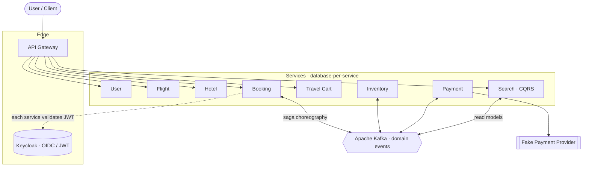

<!--
  Central README for Atlas (public "front door").
  Suggested home: a dedicated public hub repo (e.g. atlas-event-lab/atlas) or the org
  .github profile repo. Self-contained; does not reference the private SDD /docs folder.
  Before publishing: set the real repo URLs and, ideally, add screenshots/GIFs where marked.
-->

<div align="center">

# 🌍 Atlas

**Learn distributed systems by running one — not just by reading about them.**

A production-inspired, event-driven travel-booking platform you can stand up, break on
purpose, and watch heal. Built to make **Kafka, Event-Driven Architecture, the Saga pattern,
CQRS and Kubernetes** tangible — with every hard guarantee *demonstrated by a reproducible
experiment*, not asserted in prose.

[](./LICENSE)
[](#)
[](./diagrams)
[](./DEPLOYMENT-RUNBOOK.md)

</div>

<!-- Suggestion: add a short GIF here of a booking flowing through the saga (Grafana trace),
     or a screenshot of the RED dashboard. Nothing sells a distributed-systems lab like seeing
     it heal in real time. -->

---

## Why Atlas?

Most distributed-systems learning stops at the whiteboard. Atlas is the opposite: a **real,
running system** where the genuinely hard parts — effectively-once processing over
at-least-once delivery, saga compensation, the no-oversell invariant, crash recovery,
read-model rebuilds — are **shown working under load and failure**, with the scripts and
results in the repo so you can reproduce (and question) them yourself.

If you are learning event-driven architecture, Kafka, or microservices — or you want a
portfolio-grade reference architecture you can actually deploy — this is a lab you can clone
and run today.

**Who it's for**

- Backend engineers leveling up on event-driven and distributed patterns.
- People preparing for system-design interviews who want a concrete, end-to-end example.
- Anyone who wants to *see* a saga confirm, fail, time out and compensate — with distributed
  traces in Grafana — instead of trusting that it would.

> Atlas is **not** a commercial product. It is an open learning laboratory: reproducible, and
> meant to be read, run, broken, and improved.

---

## What you can do with it

- **Run the whole platform locally in minutes** with Docker Compose, make a booking, and
  follow it end-to-end through a **choreographed saga** across Inventory and Payment.
- **Break it on purpose.** Kill a consumer mid-saga, stall the payment provider, replay
  duplicate messages, poison a queue — and watch the system stay correct: no double charges,
  no oversell, no lost or stranded bookings.
- **Push it under load** with k6 and watch it scale out via HPA / KEDA instead of falling over.
- **Stand up a real cluster on your own cloud** — vendor-agnostic by design, made to ride
  free-trial credits (Oracle OKE, GKE, EKS, AKS) and move between them.
- **Observe everything**: distributed traces threaded across the whole saga, RED metrics,
  Kafka consumer lag — all in Grafana.

---

## The experiments — the heart of the lab

Each experiment is a self-contained probe with a **hypothesis, a runnable k6/fault-injection
script, and a written result**. This is where the claims get earned. Full details and raw
runs live in **[`experiments/`](./experiments)**.

| # | Experiment | Proves | Result so far |
|---|------------|--------|---------------|
| 01 | High booking concurrency | HPA scales the hot path; the pool keeps DB connections bounded | Scaled to **~28.8k bookings at 100% success** after tuning; latency degrades gracefully, no error cliff |
| 02 | Inventory contention | Many concurrent bookings for one scarce seat never oversell | **No oversell** — 400 racers on capacity 314 settle to exactly 314/314, 0 stuck |
| 03 | Duplicate messages / idempotency | At-least-once delivery + idempotent consumers = effectively-once | 106 redelivered events, **all skipped as duplicates**, zero state change |
| 04 | Consumer crash mid-saga | A killed consumer resumes with no loss and no double-processing | 1000 bookings, 2 payment pods killed mid-flight → **0 double charges**, 0 left in-flight |
| 05 | Payment timeout → compensation | A stalled payment times out and the saga compensates, returning stock | 20 stalls → 20 expiries, inventory **and** read models return to baseline |
| 06 | Dead-letter-queue recovery | A poison message parks; a recoverable one replays cleanly | Replay path implemented; scripted run pending |
| 07 | Read-model rebuild | The CQRS read side is fully derivable by replaying events | Rebuild works within retention; the run **surfaced the beyond-retention gap** and drove a resync design |

The interesting part isn't just the green checks — it's the **findings**. Experiment 07, for
instance, failed in a useful way (data aged out of Kafka retention), exposed a real gap, and
produced the fix. That's the kind of thing this lab is for.

---

## Stand it up on your own cloud (trial-friendly)

Atlas is built to be **platform-agnostic**. Everything stateful — PostgreSQL, Kafka, Keycloak
— runs **inside the cluster** via operators (CloudNativePG, Strimzi, the Keycloak operator),
so the only vendor-specific surfaces are the node pool and the LoadBalancer. That means you
can:

- Bring it up on **any conformant Kubernetes** using free-trial credits, then **tear it down
  and rebuild it on the next vendor's trial** with minimal change.
- Practice the full operational loop: operators, GitOps-style Helm deploys, sealed secrets,
  autoscaling, cost controls (idle-down scripts), and observability wiring.

The complete, ordered, vendor-agnostic guide — with a per-vendor porting table
(OKE / GKE / EKS / AKS / local `kind`) — is in **[`DEPLOYMENT-RUNBOOK.md`](./DEPLOYMENT-RUNBOOK.md)**.

---

## Architecture at a glance



Full diagrams — system context, the booking saga (happy path and compensation), state
machines, payment flow, CQRS projections, and the Kafka event map — are in
**[`diagrams/`](./diagrams)**. The reasoning behind the design lives as
**[Architecture Decision Records](./docs/adr)** in `docs/adr/`.

**Non-negotiable principles:** database per service (no cross-service joins or foreign keys) ·
no distributed transactions / 2PC — consistency via the **Saga pattern** · events preferred
over synchronous REST · every endpoint born from a contract · identity via Keycloak JWTs
validated by each service.

---

## Services (multi-repo)

Each service is an independent repository with its own CI pipeline.

| Service | Responsibility | Status |
|---------|----------------|--------|
| API Gateway | Single entry point · path routing (nginx / ingress-nginx) | Config-only |
| User | Profile & preferences | Implemented |
| Flight | Flight catalog | Implemented |
| Hotel | Hotel catalog | Implemented |
| Inventory | Seat/room availability & reservation locks (no-oversell) | Implemented |
| Travel Cart | Pre-booking selection (1 flight + 1 hotel), TTL | Implemented |
| Booking | Booking lifecycle · saga choreography | Implemented |
| Payment | Payment lifecycle · crash-safe, idempotent charging | Implemented |
| Search | Flight & hotel search read models (CQRS) | Implemented |
| Notification | Email notifications | Planned |

> Repository URLs live under the `atlas-event-lab` organization. Update the **Status** column
> each release.

---

## Start here — a suggested path

1. **Skim the [diagrams](./diagrams)** — context, the saga, the state machines. ~10 minutes.
2. **Run it locally** ([`QUICKSTART.md`](./QUICKSTART.md)) and create a booking; watch it go
   `PENDING → INVENTORY_RESERVED → CONFIRMED`.
3. **Break it** — replay duplicates (Exp 03) or kill a consumer mid-saga (Exp 04) and confirm
   nothing double-charges or oversells.
4. **Load-test it** (Exp 01) and watch it scale.
5. **Deploy it** to a cluster on trial credits ([`DEPLOYMENT-RUNBOOK.md`](./DEPLOYMENT-RUNBOOK.md)).
6. **Read the [ADRs](./docs/adr)** to see *why* each decision was made.

---

## Quickstart (local)

```bash
git clone https://github.com/atlas-event-lab/atlas.git
cd atlas
# export your Keycloak realm first (see deploy-local/keycloak/README.md)
DB_PASSWORD=atlas docker compose up -d
docker compose ps                 # wait until healthy
curl http://localhost:8080/health # gateway smoke test
```

Then follow **[`QUICKSTART.md`](./QUICKSTART.md)** for a token, a catalog search, and a full
end-to-end booking (including the failure paths).

---

## How it's built

Atlas is developed with **Specification-Driven Development (SDD)**: behavior is designed as
specifications and contracts first, and the code implements them. REST endpoints are
**contract-first**; events are described in **AsyncAPI**; cross-cutting and cross-service
decisions are captured as **ADRs** (27 and counting). Consistency is enforced mechanically
(formatting via Spotless, style via Checkstyle, tests as a CI gate).

---

## Tech stack

Java 21 · Spring Boot · Spring Data JPA · PostgreSQL · Apache Kafka · Redis · Keycloak ·
nginx / ingress-nginx · Docker · Kubernetes · Helm · Strimzi · CloudNativePG · KEDA ·
Prometheus · Loki · Tempo · Grafana · GitHub Actions · k6

---

## Roadmap

- **Notification service** (email/notification history) — specified, not yet built.
- **Phase 2 — Saga orchestration**: migrate the same saga from choreography to orchestration
  to compare the two approaches head-to-head.
- **Experiment 06** (DLQ recovery) scripted run, and more fault-injection scenarios.
- Deploy on a second cloud to validate the portability thesis end-to-end.

**Releases:** see the [`CHANGELOG.md`](./CHANGELOG.md). `v1.0.0` is intentionally gated on one
acceptance test — standing up the platform on a **fresh cluster by following the deployment
runbook alone** — so the "runs on any Kubernetes" claim is proven, not just written.

---

## Contributing

Questions, corrections, and experiment proposals are all welcome — this is a place to learn.
See **[`CONTRIBUTING.md`](./CONTRIBUTING.md)** and **[`CODE_OF_CONDUCT.md`](./CODE_OF_CONDUCT.md)**.
Security reports: **[`SECURITY.md`](./SECURITY.md)**.

## License

Distributed under the **Apache License 2.0**. See [`LICENSE`](./LICENSE).
