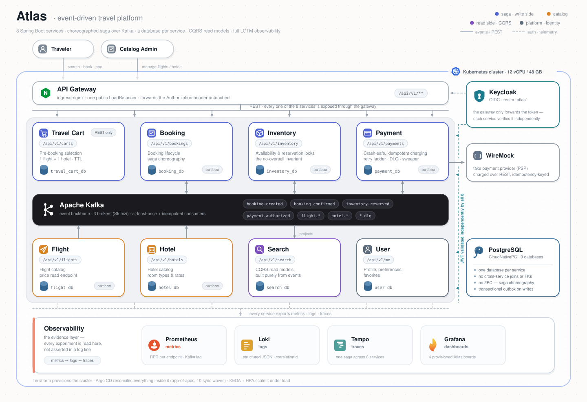

<!--
  Hub-repo README (atlas-event-lab/atlas). This is the repo-level front door: what lives HERE
  (architecture, the deploy automation, the experiments) and how to use it. The project vision,
  the "why", and the org-wide overview live in the organization profile:
    https://github.com/atlas-event-lab  (rendered from atlas-event-lab/.github → profile/README.md)
  Community-health files (LICENSE, CONTRIBUTING, CODE_OF_CONDUCT, SECURITY) live in that same
  `.github` repo and GitHub applies them to this repo automatically.
-->

# 🌍 Atlas — hub

**The central repo: the architecture, the one-command deployment, and the experiments.**

Stand up the **entire** event-driven platform on your own Kubernetes cluster — the 8 services,
Kafka, Postgres, Keycloak, autoscalers, and full observability — then run the experiments that
turn its guarantees into evidence.

**New here?** Start with the project overview and vision on the
**[organization profile](https://github.com/atlas-event-lab)**, then come back to run it.

---

## What's in this repo

This is the **hub** — everything you need to understand, deploy, and experiment on Atlas:

- **The architecture** — diagrams and the decision records behind them.
- **The deployment automation** — GitOps + scripts that bring the whole stack up on a fresh
  cluster, plus a manual runbook and a local Docker-Compose option.
- **The experiments** — the resilience/scalability probes, with their scripts and results.

The **service code** lives in its own per-service repositories under the
[organization](https://github.com/atlas-event-lab); this repo wires them together and deploys them.

---

## Understand the architecture

Start with the diagrams in **[`diagrams/`](./diagrams)** — system context, the booking saga
(happy path _and_ compensation), the service state machines, the payment flow, the CQRS search
projections, and the Kafka event/topic map:

| Diagram | What it shows |
|---------|---------------|
| [`diagrams/README.md`](./diagrams/README.md) | Index + system context |
| [`diagrams/booking-saga.md`](./diagrams/booking-saga.md) | The saga: confirm, fail, time out, compensate |
| [`diagrams/inventory.md`](./diagrams/inventory.md) | Reservation locks & the no-oversell invariant |
| [`diagrams/payment.md`](./diagrams/payment.md) | Crash-safe, idempotent charging |
| [`diagrams/search-cqrs.md`](./diagrams/search-cqrs.md) | CQRS read models built from events |
| [`diagrams/events-and-topics.md`](./diagrams/events-and-topics.md) | The Kafka event & topic map |

The **reasoning** behind each design decision is captured as
**[Architecture Decision Records](./docs/adr)** in `docs/adr/`.

**Non-negotiable principles:** database per service (no cross-service joins or foreign keys) ·
no distributed transactions / 2PC — consistency via the **Saga pattern** · events preferred over
synchronous REST · every endpoint born from a contract · identity via Keycloak JWTs validated by
each service.

---

## Services

Each service is an independent repository with its own CI pipeline; this repo deploys them.

| Service | Responsibility | Status |
|---------|----------------|--------|
| [API Gateway](./gateway/nginx/nginx.conf) | Single entry point · path routing (nginx / ingress-nginx) | Config-only |
| [User](https://github.com/atlas-event-lab/atlas-user-service) | Profile & preferences | Implemented |
| [Flight](https://github.com/atlas-event-lab/atlas-flight-service) | Flight catalog | Implemented |
| [Hotel](https://github.com/atlas-event-lab/atlas-hotel-service) | Hotel catalog | Implemented |
| [Inventory](https://github.com/atlas-event-lab/atlas-inventory-service) | Seat/room availability & reservation locks (no-oversell) | Implemented |
| [Travel Cart](https://github.com/atlas-event-lab/atlas-travel-cart-service) | Pre-booking selection (1 flight + 1 hotel), TTL | Implemented |
| [Booking](https://github.com/atlas-event-lab/atlas-booking-service) | Booking lifecycle · saga choreography | Implemented |
| [Payment](https://github.com/atlas-event-lab/atlas-payment-service) | Payment lifecycle · crash-safe, idempotent charging | Implemented |
| [Search](https://github.com/atlas-event-lab/atlas-search-service) | Flight & hotel search read models (CQRS) | Implemented |
| Notification | Email notifications | Planned |

---

## Start here — the path

The whole point of Atlas is to **deploy your own cluster and run the experiments on it**, then
_see_ the evidence in Grafana — that only happens on Kubernetes, not locally.

And you can stand up the **entire architecture** yourself: the 8 services, **Kafka** and its
autoscalers, the **Postgres** databases, the **observability** stack (Prometheus / Loki / Tempo /
Grafana), and **Keycloak** for auth — all wired together and **automated in scripts**, so you
spin it up quickly and spend your time on the experiments instead of on plumbing. That is the
fast path to building real intuition for **Kafka, Event-Driven Architecture, distributed systems,
observability, and microservices**.

1. **Read the architecture** — start with the [diagrams](./diagrams) — to understand the system
   context, the booking saga, and the service state machines (~15 min)
2. **Deploy the platform.** choose one of two paths:
   - **Manual runbook** — the ~30 ordered `kubectl`/`helm` commands, to understand what each
     piece does: **[`DEPLOYMENT-RUNBOOK.md`](./DEPLOYMENT-RUNBOOK.md)**.
   - **GitOps (recommended)** — `terraform apply` then **one**
     `bootstrap.sh`, and Argo CD converges the entire stack wave by wave:
     **[`deploy/argocd/README.md`](./deploy/argocd/README.md)**.
3. **Open the dashboards** — make your first booking, then follow it through Grafana, Tempo and
   Kafka UI.
4. **Run the experiments** - load-test, replay duplicate events, kill consumers, trigger saga
   compensation, and observe the results live:
   [`experiments/`](./experiments)

5. **Read the [ADRs](./docs/adr) (Optional)** - understand the reasoning behind every architectural decision.
6. **Destroy the cluster when you're done** — cloud providers charge while worker nodes are
   running. Tear the cluster down to avoid unnecessary costs:
   - **Civo:** `./deploy/ops/civo/cluster.sh down` or `terraform destroy` — the cluster is
     gone and billing drops to **$0**.
   - **Oracle OKE:** `./deploy/cluster/oracle/terraform terraform destroy` — destroys the cluster.

> **Just want to poke the API by hand, without a cluster?** There's a local Docker-Compose
> walkthrough in [`deploy-local/LOCAL-DEPLOYMENT.md`](./deploy-local/LOCAL-DEPLOYMENT.md).
> It's for manual API play only — the experiments need Kubernetes.

Stuck on a deploy? Known issues and fixes live in
**[`deploy/TROUBLESHOOTING.md`](./deploy/TROUBLESHOOTING.md)**.

---

## Cloud requirements and costs

Atlas is designed to run on a **12 vCPU / 48 GB** Kubernetes cluster. That size is intentional:
it is large enough to demonstrate autoscaling, Kafka, observability, and distributed-system
behavior under load.

The recommended providers are **Oracle Cloud (OKE)** and **Civo** because their trial credits are
large enough to run the complete platform.

| Provider | 24×7 | ~4 h/day | Cluster destroyed | Trial credits |
|-----------|-----:|---------:|------------------:|--------------:|
| Oracle OKE (Enhanced) | **$286.12/month** | ~$110/month | $0 | ~$300 — about one month at 24×7 |
| Civo | **$261/month** | ~$43/month | $0 | ~$250 — about 700 cluster-hours |

The exact cost depends on the provider, cluster configuration, and how long the infrastructure remains provisioned. For Atlas, the most important cost-saving measure is to destroy the cluster when you are done experimenting.

#### Oracle OKE cost breakdown

| Line item | $/month | Scales with node-hours? |
|-----------|--------:|-------------------------|
| Node pool — cluster type **Enhanced** | 74.40 | **No — bills while the cluster exists, even at 0 nodes** |
| Compute `VM.Standard.E5.Flex` 2 OCPU / 16 GB × 3 | 205.34 | Yes |
| Block storage 50 GB × 3 (boot volumes) | 6.38 | Yes |
| **Total** | **286.12** | |

The Enhanced cluster fee is a fixed baseline cost. Scaling the node pool down to zero removes the compute and boot-volume costs, but the `$74.40`/month cluster fee continues while the cluster exists. This means that scaling the node pool to zero reduces the cost substantially, but terraform destroy is required to bring the infrastructure cost down to `$0.

> **Note**: A Basic OKE cluster has a free control plane and does not have > this same fixed cluster fee. Make sure you know which OKE cluster type you provisioned.

#### Civo

Civo's control plane is free, so once the cluster and its resources are destroyed, the infrastructure cost reaches $0.
The simplest cost strategy

Atlas does not need to run 24×7. A practical workflow is:
**Provision** → **run experiments** → **inspect Grafana/Kafka** → **destroy the cluster**.
Atlas includes helper scripts for both providers to make teardown a one-command operation.

See:

- `deploy/ops/README.md`
- `deploy/cluster/civo/terraform/README.md`
---

## How it's built

Atlas is developed with **Specification-Driven Development (SDD)**: behavior is designed as
specifications and contracts first, and the code implements them. REST endpoints are
**contract-first**; events are described in **AsyncAPI**; cross-cutting and cross-service
decisions are captured as **ADRs**. Consistency is enforced mechanically (formatting via Spotless,
style via Checkstyle, tests as a CI gate).

---

## Tech stack

Java 21 · Spring Boot · Spring Data JPA · PostgreSQL · Apache Kafka · Redis · Keycloak ·
nginx / ingress-nginx · Docker · Kubernetes · Helm · Argo CD · Strimzi · CloudNativePG · KEDA ·
Prometheus · Loki · Tempo · Grafana · GitHub Actions · k6 · Terraform

---

## Future Changes

- **Notification service** (email / notification history) — specified, not yet built.
- **Phase 2 — Saga orchestration**: migrate the same saga from choreography to orchestration to
  compare the two approaches head-to-head.
- **CDC for the outbox pattern** — replace the polling outbox relay with **log-based Change Data
  Capture via Debezium**, streaming committed changes straight from the Postgres WAL to Kafka.
- **Avro + Schema Registry** — move Kafka messaging to **Avro** serialization backed by a
  **Schema Registry**, for enforced, versioned event schemas and compatibility checks.
---

_Part of the **Atlas Event Lab** — see the [organization profile](https://github.com/atlas-event-lab)
for the vision, the full overview, contributing guide, and license (Apache-2.0)._
