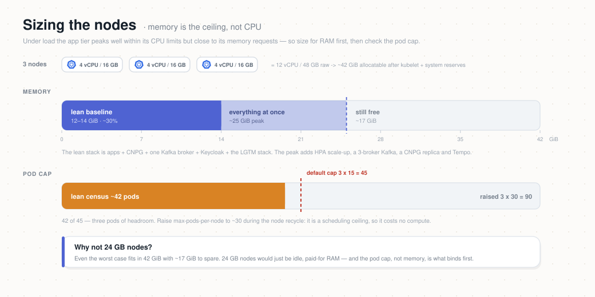

# Provisioning a cluster — vendor alternatives

Atlas is **vendor-agnostic by design**: everything stateful (Postgres, Kafka, Keycloak)
runs *inside* the cluster, so the only vendor-specific surfaces are the **node pool** and
the **LoadBalancer** that fronts Ingress. This page covers **how to stand up the cluster
itself** on a cloud of your choice. Once you have a `Ready` cluster and a `kubectl`
context pointing at it, deploy the platform onto it with the
[Deployment Runbook](../../DEPLOYMENT-RUNBOOK.md).

You do **not** need the exact cluster below — any conformant Kubernetes works. What
follows is a **reference sizing** proven to run the whole lab (all services + Kafka +
Postgres + Keycloak + the LGTM observability stack), plus turnkey, reproducible setups for
two clouds you can copy and adapt.

> **Two concerns, two tools.**
> - **Provision** the cluster (network + control plane + node pools) → **Terraform**, one
>   short module per cloud under [`cluster/<cloud>/terraform/`](.). Same workflow
>   everywhere: `terraform init && terraform apply` to create, `terraform destroy` to
>   remove. Add a future cloud = add another module, same commands.
> - **Operate** it day to day (turn compute off when idle to save credit) → small scripts
>   under [`deploy/ops/`](../ops). Terraform manages infrastructure state; it is not the
>   tool for "power the cluster off every night."
>
> There is no *single identical script* for all clouds — each cloud's managed-Kubernetes
> and network APIs differ. Terraform is the closest: one tool, one workflow, a small
> per-cloud module.

---

## Reference sizing (what the lab needs)

The full stack fits comfortably in **~12–14 GiB at idle**, scaling up under load. The
reference node pool that hosts it:

| Dimension | Reference value | Why |
|-----------|-----------------|-----|
| Nodes | **3** | Survives a node loss; spreads Kafka/Postgres/services |
| Per node | **~4 vCPU / 16 GB** | Memory is the binding constraint, not CPU |
| Total | **~12 vCPU / 48 GB** | Headroom for HPA scale-up + 3-broker Kafka experiments |
| Pods/node | **~30** | Raised from a low default so the pod cap isn't the bottleneck |
| Boot disk | **50 GB/node** | OS + image cache only; data lives on PVCs |
| Networking | Pod-per-IP CNI, services CIDR `10.96.0.0/16` | Standard cluster networking |
| Storage | A block-storage `StorageClass` | Postgres/Kafka/observability PVCs |
| Load balancer | 1 cloud LB + stable public IP | Single entry point; Keycloak issuer is pinned to it |



> **Memory is the ceiling, not CPU.** Under load the app tier peaks well within its CPU
> limits but close to its memory requests, so size for RAM first. A leaner
> **6 vCPU / 24 GB** (3 × 2 vCPU / 8 GB) runs the baseline, but leaves little room for the
> full scaling/resilience experiments — the reference **12 vCPU / 48 GB** is what those need.

---

## Option A — Oracle Cloud (OKE) — the original

The lab was first built on **Oracle Container Engine for Kubernetes (OKE)**, on Oracle's
free-trial credits.

| Attribute | Value |
|-----------|-------|
| Service | OKE (managed Kubernetes) |
| Region | US East (Ashburn) |
| Kubernetes | pinned to a supported version at creation |
| Cluster networking | VCN-native pod networking (each pod gets a VCN IP) |
| Services CIDR | `10.96.0.0/16` |
| API endpoint | Public + private |
| Node pool | **3 × `VM.Standard.E5.Flex`, 2 OCPU / 16 GB**, ~30 pods/node, 50 GB boot |
| Storage | OCI Block Volume (`oci-bv` StorageClass) via the OCI CSI driver |
| Edge | OCI-managed LoadBalancer on a service-LB subnet |
| Cost | **$286.12/mo at 24×7** ($74.40 Enhanced cluster fee + $205.34 compute + $6.38 boot storage); ~$110/mo at 4 h/day. The cluster fee **does not** stop when the pool scales to 0 — see [`deploy/ops/`](../ops/README.md) |

> **OCPU vs vCPU.** On OCI, `E5.Flex` is AMD EPYC (x86) where **1 OCPU = 2 vCPU**, so the
> pool above is **12 vCPU / 48 GB** in the terms used everywhere else on this page.

**Provision (Terraform):** [`oracle/terraform/`](./oracle/terraform) uses the official OKE
module, which builds the VCN, subnets and the security rules OKE needs, plus the cluster
and worker pool — the *Quick Create* topology, reproducibly.

```bash
cd deploy/cluster/oracle/terraform   # from repo root
cp terraform.tfvars.example terraform.tfvars   # your OCIDs, region, ssh key
terraform init && terraform apply
```

See [`oracle/terraform/README.md`](./oracle/terraform/README.md) for auth setup and a
first-run note on verifying the module inputs.

**Operate (cost control):** scale the worker pool to 0 when idle with
[`deploy/ops/`](../ops/README.md) — set `NODEPOOL_OCID` to your own pool (from
`terraform output worker_pool_ids`). This removes the $211.72/mo of compute and boot
volumes; on an **Enhanced** cluster the $74.40/mo cluster fee keeps running, so use
`terraform destroy` to reach $0:

```bash
cd deploy/ops/oracle                  # from repo root
export NODEPOOL_OCID="ocid1.nodepool.oc1..."   # your pool (or set it in config.env)
./cluster-down.sh   # node pool -> 0, worker compute billing stops
./cluster-up.sh     # node pool -> 3, waits for Ready
```

> The `deploy/ops/` scripts read `NODEPOOL_OCID` from the environment or a gitignored
> `config.env` — nothing is hardcoded, so they work on any tenancy.

---

## Option B — Civo — no trial quota gate

Some clouds' free trials cap total vCPUs and won't let you raise the cap without upgrading
to a paid account, which makes the full 12 vCPU cluster impossible on the trial. **Civo**
(and DigitalOcean, Linode, Vultr) gate only on **credit** — so 12 vCPU / 48 GB just works.
Civo gives **$250 for the first month**, a free control plane, and clusters Ready in ~2 min.

Because the experiments keep the cluster hot, Civo uses a **single fixed pool** sized
straight at the experiment target:

| Attribute | Value |
|-----------|-------|
| Managed Kubernetes | Civo (k3s), control plane **free** |
| Node pool | **3 × `g4p.kube.small` (4 vCPU / 16 GB) = 12 vCPU / 48 GB**, fixed |
| Storage | Civo Volumes CSI (`civo-volume` StorageClass) |
| Cost | ~$0.357/h ≈ **$261/mo at 24/7**; credit ≈ **700 cluster-hours** → run part-time |

**Provision (Terraform):** [`civo/terraform/`](./civo/terraform)

```bash
cd deploy/cluster/civo/terraform      # from repo root
export CIVO_TOKEN="your-civo-api-key"
terraform init && terraform apply
./save-kubeconfig.sh && export KUBECONFIG=~/.kube/civo-atlas.yaml   # reliable (falls back to the Civo CLI)
kubectl get nodes
```

**Operate:** Civo has no "stop" — the off switch is `terraform destroy` (stops all billing;
recreate in ~2 min). Wrapper: [`deploy/ops/civo/cluster.sh`](../ops/civo) (`up`/`down`/`status`).
PVC data is ephemeral unless volumes use `reclaimPolicy: Retain` — fine for the
state-resetting experiments. Full notes: [`civo/terraform/README.md`](./civo/terraform/README.md).

---

## After the cluster is up (either option)

> Hit an error during `apply`, `plan`, or getting `kubectl` connected? Check
> [`deploy/TROUBLESHOOTING.md`](../TROUBLESHOOTING.md) — known cases and fixes per cloud.

1. Confirm `kubectl get nodes` shows your nodes `Ready`.
2. Note your `StorageClass` name (`oci-bv`, `civo-volume`, …) — you set it in the CNPG and
   Kafka manifests.
3. Follow the [Deployment Runbook](../../DEPLOYMENT-RUNBOOK.md) to install operators, the
   platform, and the services.

---

## Adapting to other clouds (GKE / EKS / kind)

The same reference sizing applies; only three things change per vendor, all called out in
the runbook's prerequisites: the **`StorageClass`** name, how the **LoadBalancer** is
provisioned (a cloud LB, or MetalLB/NodePort on local `kind`/`k3d`), and keeping a
**stable public IP/hostname** for the Keycloak issuer. To add a cloud, drop a new
`cluster/<cloud>/terraform/` module (GKE and EKS both have official Terraform modules) —
same `terraform init && apply` workflow — and, if you want on/off cost control, a small
lifecycle script under `deploy/ops/`.
