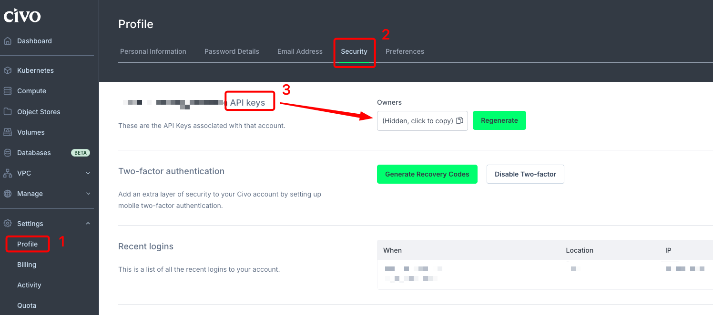

# Civo Kubernetes — Terraform

Provisions the Atlas cluster on [Civo](https://www.civo.com/) as a **single fixed pool**:
`3 × g4p.kube.small (4 vCPU / 16 GB)` = **12 vCPU / 48 GB**. This is the size the
scalability/performance/resilience experiments run at, so the cluster always comes up at
full size — a single fixed pool. Civo's control plane is free and clusters are Ready in
~4 min, which makes "destroy when idle, recreate when needed" a practical cost lever.

## Prerequisites

- [Terraform](https://developer.hashicorp.com/terraform/install) ≥ 1.5
- A Civo account and an API key — create one in the Dashboard (Account → Security → API
  keys), see image below.
- (optional) the [Civo CLI](https://www.civo.com/docs/overview/civo-cli) for `status`



## Use

> **Run every command below from this folder:** `deploy/cluster/civo/terraform/`.

```bash
cd deploy/cluster/civo/terraform      # from the repo root

export CIVO_TOKEN="your-civo-api-key"     # auth via env — never hardcode the token
cp terraform.tfvars.example terraform.tfvars   # optional — adjust region/name/version

terraform init                            # download the civo provider (creates .terraform/)
terraform plan                            # preview — nothing is created yet
terraform apply                           # create the cluster (~2 min). Type "yes".

# point kubectl at the new cluster (reliable — falls back to the Civo CLI if the
# provider returns an empty kubeconfig, which it often does; see TS-CIVO-01):
./save-kubeconfig.sh
export KUBECONFIG=~/.kube/civo-atlas.yaml
kubectl get nodes                         # expect 3 Ready nodes
```

> **`kubectl` can't connect?** Two cases, both in **TS-CIVO-01**
> ([Troubleshooting](../../../TROUBLESHOOTING.md#ts-civo-01--civo-kubectl-cannot-connect-empty-kubeconfig-or-stale-ip-after-a-recreate)):
> `localhost:8080 refused` (the kubeconfig came back empty right after apply), or
> `i/o timeout` on an old IP (you **recreated** the cluster — Civo gives it a new API IP, so
> **re-fetch the kubeconfig after every recreate**; `terraform output` won't help here).

## What each variable means

Only touch `terraform.tfvars`; every value has a working default (the defaults already
give the 12 vCPU / 48 GB cluster).

| Variable | Default | What it does |
|----------|---------|--------------|
| `civo_token` | `""` (uses `CIVO_TOKEN` env) | Civo API key. **Prefer the env var**; leave empty here. |
| `region` | `NYC1` | Civo region. Others: `LON1`, `FRA1`, `PHX1` … (`civo region ls`). |
| `cluster_name` | `atlas-civo` | Cluster name (also names the network/firewall). |
| `kubernetes_version` | `""` (Civo default) | **Pin it** (k3s format, e.g. `1.36.0-k3s1`) for reproducibility. List: `civo kubernetes versions`. |
| `cni` | `flannel` | Cluster CNI (`flannel` or `cilium`). |
| `node_size` | `g4p.kube.small` | Node type. `g4p.kube.small` = 4 vCPU / 16 GB (Performance family). List: `civo kubernetes size`. |
| `node_count` | `3` | Nodes in the fixed pool. `3 × g4p.kube.small` = 12 vCPU / 48 GB. |

Full list with types in [`variables.tf`](./variables.tf).

## Cost (free-trial budget)

- `g4p.kube.small` = **$0.119/h ≈ $86.91/mo** per node → **3 nodes ≈ $0.357/h ≈ $261/mo**
  at 24/7 (just over the $250 trial credit if left on all month).
- **Control plane is free.** Volumes (PVCs) bill separately (~$0.10/GB/mo).
- The credit buys **~700 cluster-hours** — plenty for part-time experiment runs. Turn the
  cluster off between sessions.

## Turning it off

Civo has no "stop"; the off switch is destroying the cluster (stops all billing):

```bash
terraform destroy        # from this folder — $0 while down
```

**Prefer the wrapper** [`deploy/ops/civo/cluster.sh`](../../../ops/civo) (`up`/`down`/`status`)
over a bare `terraform destroy` for teardown. A raw `destroy` fails on the last step with
`DatabaseNetworkInUseByVolumes`: the stateful pods (Kafka, Postgres, observability) each get a
Civo **block volume** that Terraform didn't create and can't delete, so the volumes orphan and
block the network. `cluster.sh down` deletes the PVCs first (letting the CSI free the volumes) and
sweeps any leftovers as a fallback. If you already hit the error, see
[TROUBLESHOOTING TS-CIVO-03](../../../TROUBLESHOOTING.md#ts-civo-03--civo-terraform-destroy-fails-databasenetworkinusebyvolumes).

> ⚠️ **Data:** teardown removes those volumes, so PVC data (Postgres/Kafka) is **lost** unless the
> PVs use `reclaimPolicy: Retain`. Treat the cluster as ephemeral and re-seed on `up` (the
> experiments already reset state), or switch to Retain if you must persist data.

## Notes

- Civo provider argument names can shift across major versions; this targets `civo/civo
  ~> 1.1`. If `terraform plan` rejects an argument, check the
  [provider docs](https://registry.terraform.io/providers/civo/civo/latest/docs).
- `create_default_rules = true` on the firewall opens the ports a public cluster needs
  (6443, 80/443). Lock it down with explicit rules for a non-lab setup.
