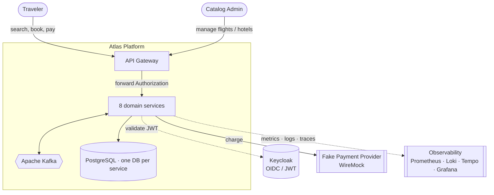
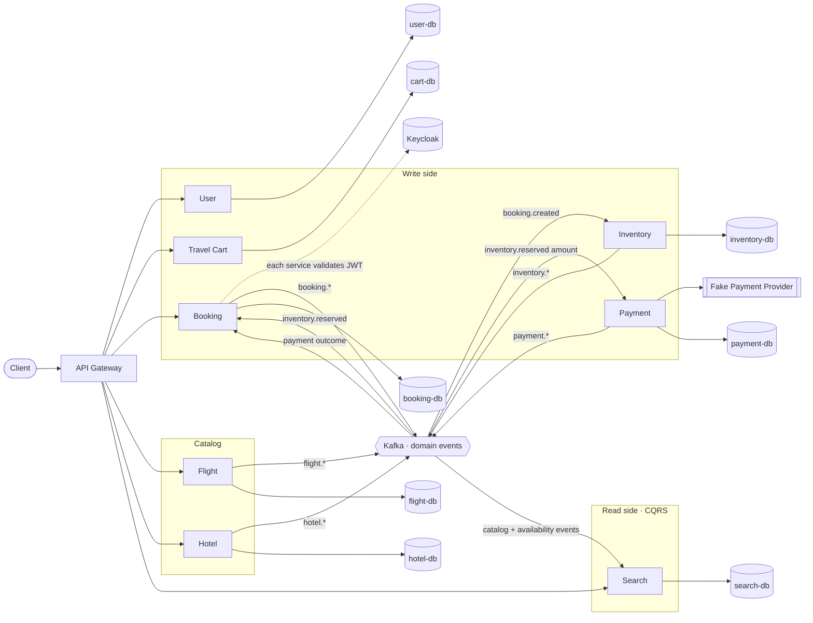
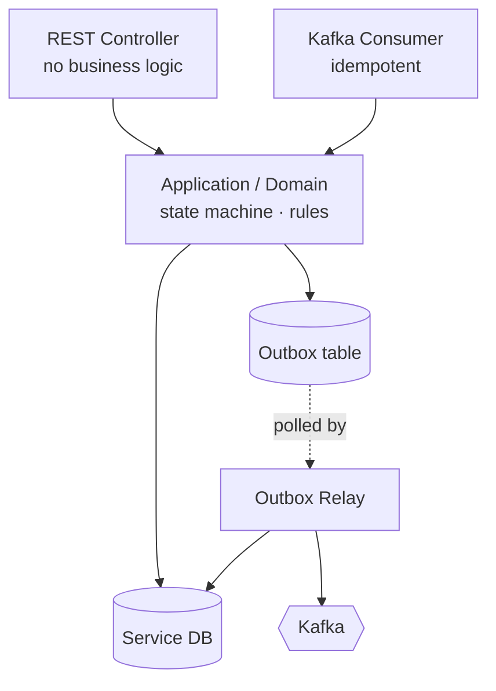

# Atlas — System Diagrams

Visual documentation of how Atlas works. These diagrams are
**informative** — the authoritative behavior lives in each service and its contracts. They
are rendered directly by GitHub (Mermaid).

> **Implementation status (keep current).** Eight services are implemented and event-wired:
> User, Flight, Hotel, Inventory, Travel Cart, Booking, Payment, Search. The API Gateway is
> configuration-only (routing/auth). Notification is planned. The diagrams show the target
> system; planned pieces are marked.

## Index

1. [System context](#1-system-context) · this page
2. [Microservices architecture](#2-microservices-architecture) · this page
3. [Booking saga — create, confirm, compensate](./booking-saga.md)
4. [Inventory — availability model & reservation lifecycle](./inventory.md)
5. [Payment — lifecycle, idempotency, recovery](./payment.md)
6. [Search — CQRS read models](./search-cqrs.md)
7. [Kafka topics & event map](./events-and-topics.md)

---

## 1. System context

Who uses Atlas and which infrastructure it talks to. The **API Gateway** is the single
entry point; **Keycloak** issues the JWTs every service validates.

---

## 2. Microservices architecture

Each service owns its database and communicates through Kafka events; synchronous REST is
used only for queries and commands that need an immediate response. No service reads another
service's database.

### Per-service internals (representative: Booking)

Every service follows the same layering: a thin REST controller, an application/domain
layer holding the business rules, a Kafka consumer for inbound saga events, and a
**transactional outbox** so state changes and event publication commit atomically.

The outbox relay reads committed rows and publishes to Kafka at-least-once; consumers
deduplicate on the envelope `eventId`, which makes the whole chain idempotent.
