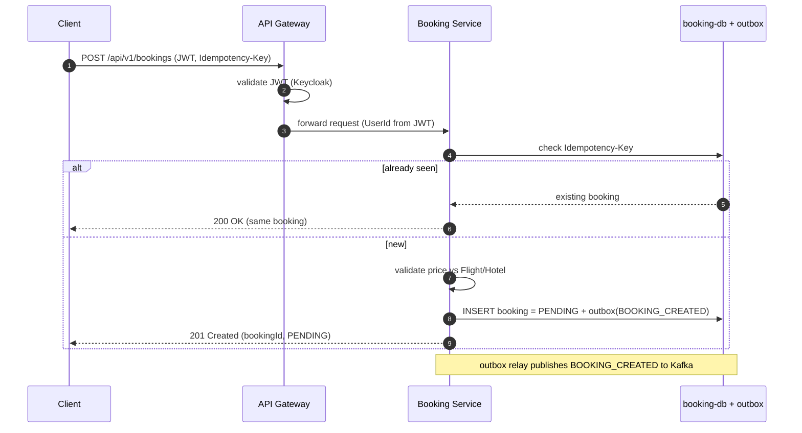
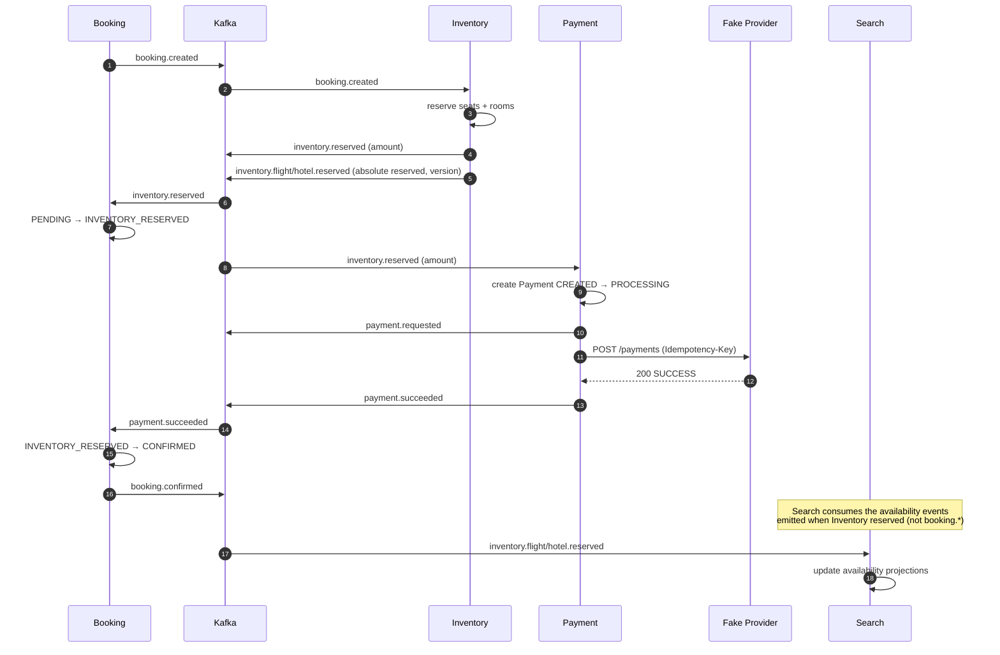
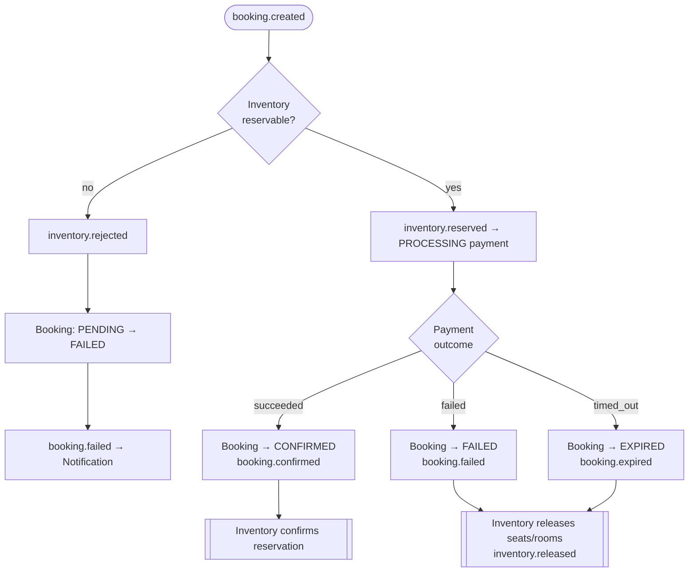
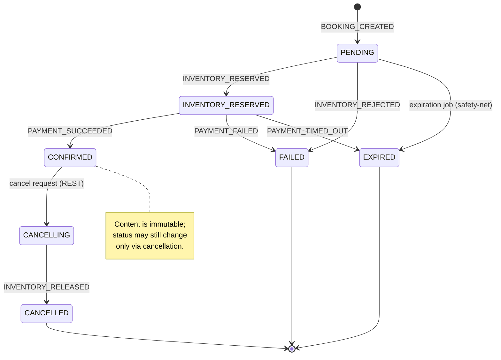
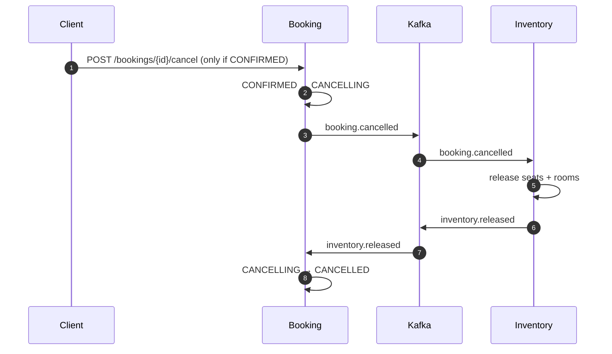

# Booking Saga

The core distributed flow in Atlas: a booking is created synchronously, then confirmed
asynchronously through a **choreographed saga** across Inventory and Payment. There is no
central orchestrator and no distributed transaction — each service reacts to events and
compensates on failure.

- [1. Create booking (synchronous REST)](#1-create-booking-synchronous-rest)
- [2. Saga — happy path](#2-saga--happy-path)
- [3. Saga — failure & compensation](#3-saga--failure--compensation)
- [4. Booking state machine](#4-booking-state-machine)
- [5. Cancellation](#5-cancellation)

---

## 1. Create booking (synchronous REST)

The write that starts everything. The controller holds no business logic; the booking is
persisted as `PENDING` and `BOOKING_CREATED` is written to the outbox in the same
transaction. The request is **idempotent** on a client key so retries never double-book.

---

## 2. Saga — happy path

`BOOKING_CREATED` triggers inventory reservation; the successful reservation carries the
`amount` that triggers payment; a successful charge confirms the booking. Every hop is a
past-tense event on its own topic.

> **Out-of-order safety.** Inventory and Payment events reach Booking on separate,
> unordered topics. A payment outcome that arrives while the booking is still `PENDING` is
> **deferred and retried** (never applied from `PENDING`, never wrongly rejected), so it
> settles once `inventory.reserved` has been processed.

---

## 3. Saga — failure & compensation

Two failure branches. Inventory rejection fails the booking before any money moves. Payment
failure/timeout fails or expires the booking and releases the already-reserved inventory —
the compensating action.

Compensation is itself event-driven: `booking.failed` / `booking.expired` /
`booking.cancelled` are consumed by Inventory, which releases the held capacity and emits
`inventory.released`.

---

## 4. Booking state machine

Booking state is the single source of truth for the lifecycle; **only Booking mutates it**,
driven by saga events. Every transition not shown is forbidden.

Ownership detail: `PENDING → EXPIRED` is owned by the scheduled expiration job;
`INVENTORY_RESERVED → EXPIRED` is owned **only** by Payment's `PAYMENT_TIMED_OUT`, to avoid
racing an in-flight payment.

---

## 5. Cancellation

A user may cancel **only** a `CONFIRMED` booking. In-flight states are intentionally not
user-cancellable (they would race the payment pivot, and Atlas has no refund path for a
settled charge). The booking stays in `CANCELLING` until compensation is confirmed.

