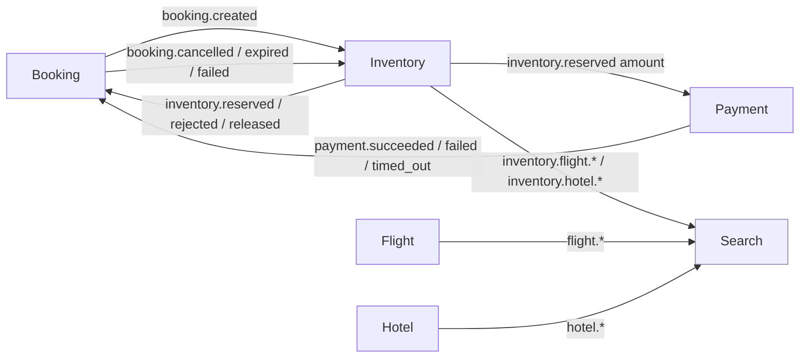
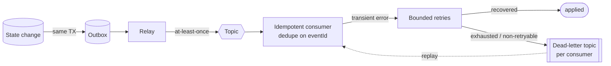

# Kafka topics & event map

How events flow through Atlas and who owns what. Naming convention: `<domain>.<event>`;
Inventory's resource-level availability events add a resource segment
(`<domain>.<resource>.<event>`). Topic names are immutable and there is exactly one business
event type per topic.

- [1. Event ownership](#1-event-ownership)
- [2. Producer → consumer map](#2-producer--consumer-map)
- [3. Reliability: outbox, retries, DLQ](#3-reliability-outbox-retries--dlq)

---

## 1. Event ownership

| Owner | Topics | Notes |
|-------|--------|-------|
| Booking | `booking.created`, `booking.confirmed`, `booking.cancelled`, `booking.expired`, `booking.failed` | Public booking lifecycle |
| Inventory (saga) | `inventory.reserved`, `inventory.rejected`, `inventory.released` | Keyed by `bookingId`; drive the saga |
| Inventory (resource) | `inventory.flight.reserved/released/expired`, `inventory.hotel.reserved/released/expired` | Keyed by `flightId` / `roomTypeId`; carry absolute `reserved` + `version` |
| Payment | `payment.requested`, `payment.succeeded`, `payment.failed`, `payment.timed_out` | `payment.timed_out` uses an underscore |
| Flight | `flight.created`, `flight.updated`, `flight.deleted` | Catalog |
| Hotel | `hotel.created`, `hotel.updated`, `hotel.deleted` | Catalog |

> Notification topics are not yet defined (service planned).

---

## 2. Producer → consumer map

Key routing facts: the amount to charge travels on `inventory.reserved` (propagated from
`booking.created.total`), so Payment needs no other input. Booking consumes only the
**saga** family from Inventory; Search consumes only the **resource** family (never the
saga family).

---

## 3. Reliability: outbox, retries & DLQ

Every producer writes events to a **transactional outbox** in the same DB transaction as its
state change, and a relay publishes them at-least-once. Consumers are idempotent on the
envelope `eventId`. Transient failures are retried with a bounded policy; exhausted or
non-retryable messages go to a **per-consumer dead-letter topic** for inspection and replay.

Each event carries a shared envelope: `eventId`, `eventType`, `eventVersion`, `occurredAt`,
`traceId`, `correlationId`, `sagaId`, `producer`, and the business `payload`. `traceId`
threads OpenTelemetry traces across the whole saga.
