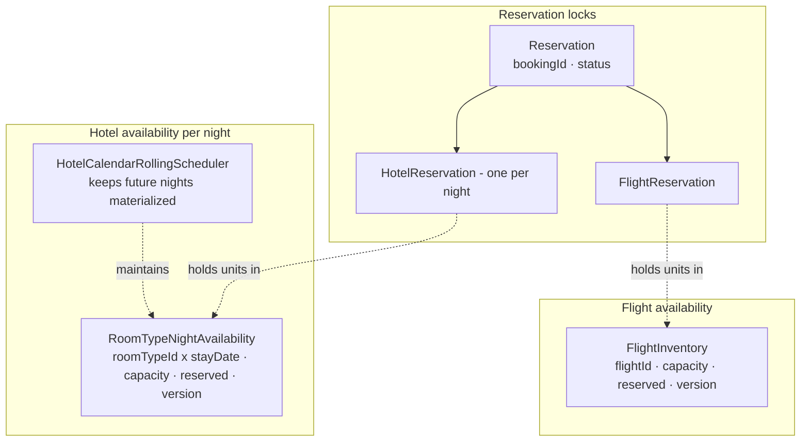
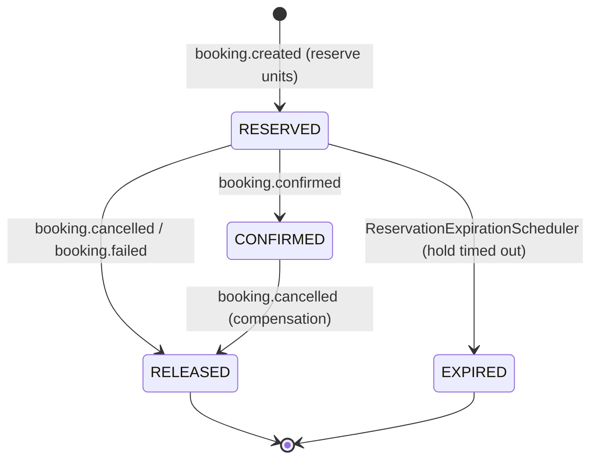
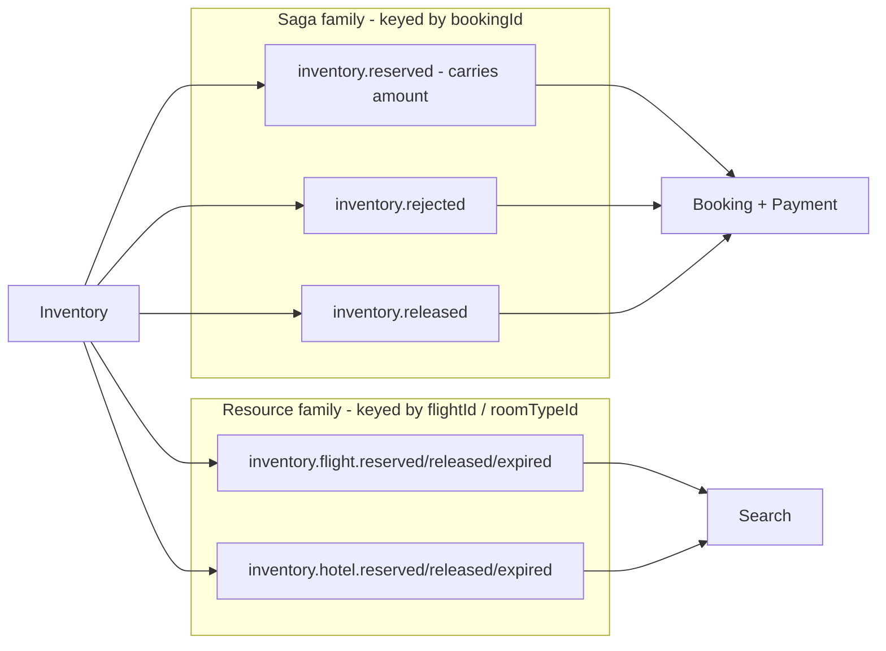

# Inventory — availability model & reservation lifecycle

Inventory is the authority for what can be reserved. It maintains **per-night** hotel
availability and per-flight seat availability, holds reservation locks during the saga, and
emits two families of events: **saga** events (for Booking) and **resource** events (for
Search). Verified against the service code.

- [1. Availability model](#1-availability-model)
- [2. Reservation state machine](#2-reservation-state-machine)
- [3. Reserve / release flow](#3-reserve--release-flow)
- [4. Two event families](#4-two-event-families)

---

## 1. Availability model

Flight capacity is tracked per flight; hotel capacity is tracked **per room-type per night**
(ADR-0008), so a stay spanning several nights reserves a row per night. A rolling scheduler
keeps the night calendar populated over the booking horizon.



`available = capacity − reserved`. Each availability row carries a monotonic `version`;
resource events publish the **absolute** `reserved` + `version` so read-side consumers apply
them last-writer-wins.

---

## 2. Reservation state machine

A reservation is created `RESERVED` when Inventory reacts to `booking.created`. It is
confirmed when the booking confirms, released on cancel/fail, or expired by the scheduler if
the saga never settles. Enum values are exactly `RESERVED`, `CONFIRMED`, `RELEASED`,
`EXPIRED`.



> Releasing or expiring a reservation returns the held units to availability and emits the
> corresponding resource event (`inventory.*.released` / `inventory.*.expired`) plus, for the
> saga, `inventory.released`.

---

## 3. Reserve / release flow

`booking.created` carries the requested flight + hotel items (with stay dates). Inventory
reserves atomically across all required rows; if any is insufficient it rejects the whole
request (no oversell). The saga result later confirms or releases the hold.

```mermaid
sequenceDiagram
    autonumber
    participant K as Kafka
    participant I as Inventory
    participant DB as inventory-db + outbox

    K->>I: booking.created (flightId, roomTypeId, nights[], amount)
    I->>DB: dedupe on eventId
    alt capacity available for all rows
        I->>DB: create Reservation=RESERVED; reserved += units (flight + each night)
        I->>DB: outbox(inventory.reserved, amount) + outbox(inventory.flight/hotel.reserved)
    else any row insufficient
        I->>DB: outbox(inventory.rejected)
    end
    Note over I,DB: later — booking.confirmed → CONFIRMED;<br/>booking.cancelled/failed/expired → RELEASED (+ inventory.released, units returned)
```

The no-oversell invariant is instrumented with domain metrics (ADR-0018) and the
duplicate-skip guard with idempotency metrics (ADR-0019).

---

## 4. Two event families

Inventory deliberately emits two topic families with **different keys** so the saga and the
read side scale independently.



Booking consumes only the saga family; Search consumes only the resource family. The
`amount` to charge rides on `inventory.reserved` (propagated from `booking.created.total`),
which is why Payment needs no other input.
