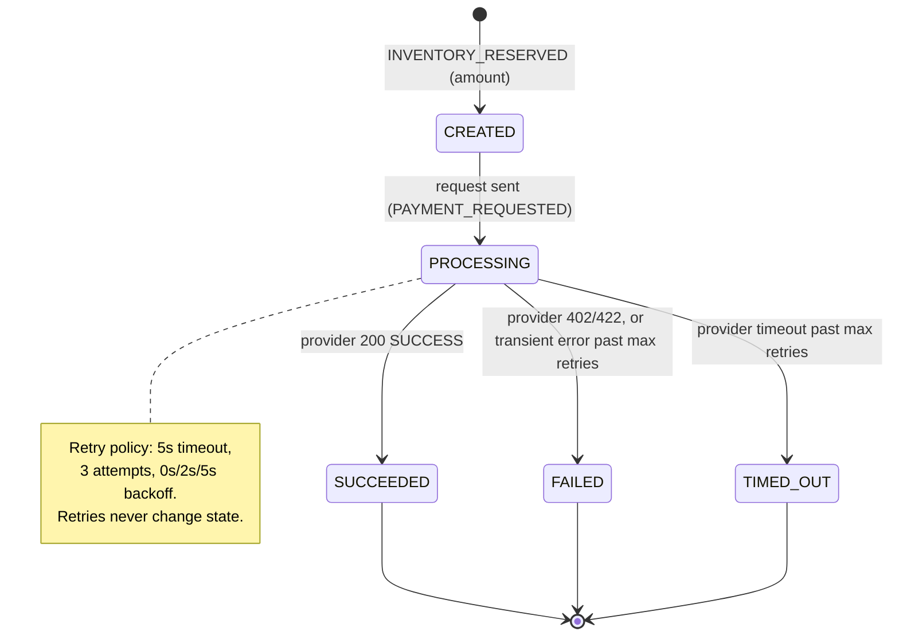
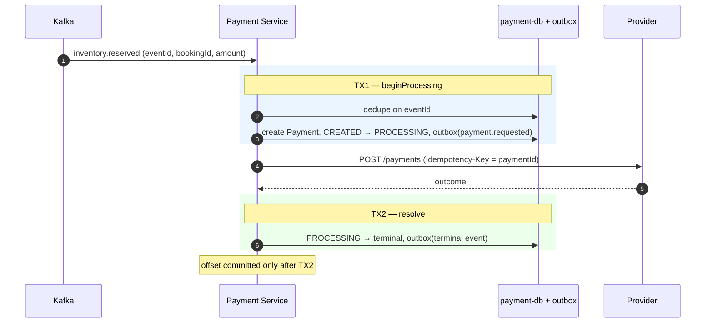
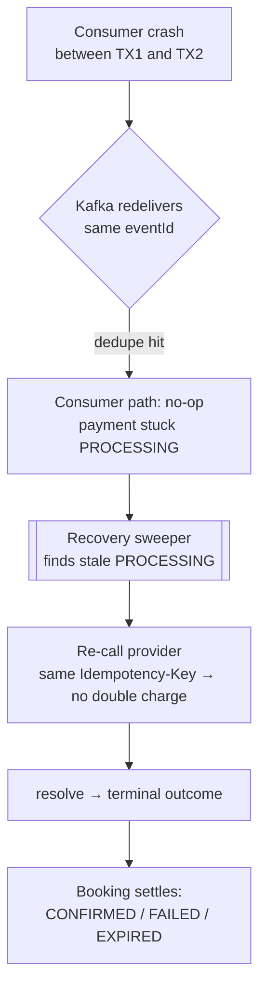

# Payment — lifecycle, idempotency & recovery

Payment is the most dangerous window in the saga: it talks to an external provider, so it
must never double-charge and must always heal after a crash. Its state is **independent**
from Booking state and owned solely by Payment Service.

- [1. Payment state machine](#1-payment-state-machine)
- [2. Split transactions & idempotency](#2-split-transactions--idempotency)
- [3. Crash recovery](#3-crash-recovery)

---

## 1. Payment state machine

A single trigger (`inventory.reserved`, which carries the `amount`) creates the payment and
drives it to a terminal outcome. Transient provider errors are retried **inside**
`PROCESSING` and do not change state.

Each terminal transition publishes its event (`payment.succeeded`, `payment.failed`,
`payment.timed_out`) via the transactional outbox, consumed by Booking to settle the saga.

---

## 2. Split transactions & idempotency

Processing is deliberately split into two DB transactions around the external provider call,
so a crash at any point is recoverable and the provider is called with a stable
`Idempotency-Key` (the `paymentId`) — the same key on every retry means the provider never
double-charges.

Idempotency has two guards: the consumer dedupes on the envelope `eventId` (a redelivered
same-event is a no-op), and the provider dedupes on the `Idempotency-Key` (a re-driven
charge for the same `paymentId` is never charged twice).

---

## 3. Crash recovery

If the consumer dies between TX1 and TX2 (around the provider call), the event was already
recorded, so redelivery is skipped as a duplicate and the payment would be stuck in
`PROCESSING`. A **recovery sweeper** re-drives stale `PROCESSING` payments using the same
`Idempotency-Key`, then resolves them — so the saga always settles.

This behavior is validated by the resilience experiments (consumer crash mid-saga, payment
timeout & compensation, duplicate-message idempotency).
