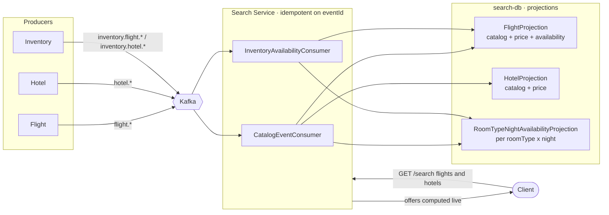
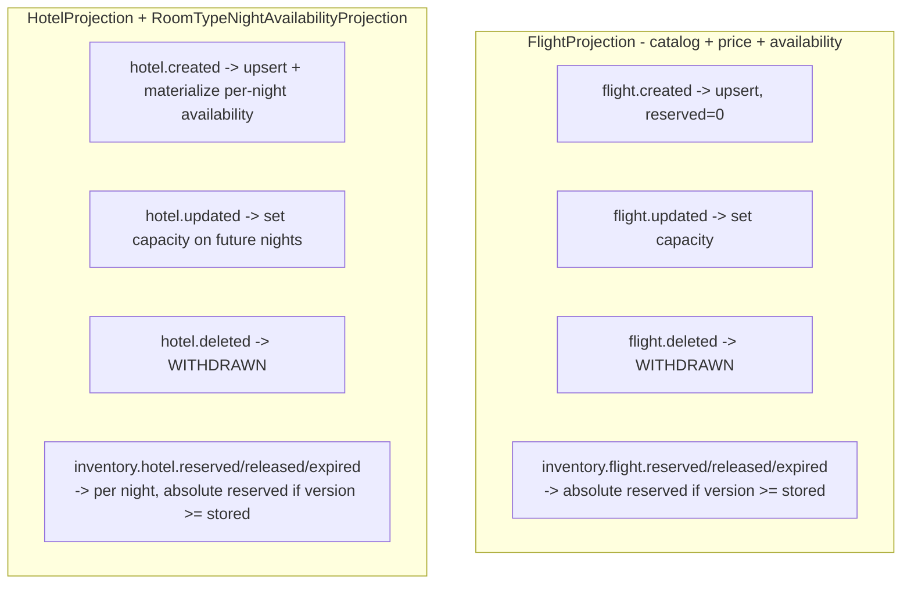
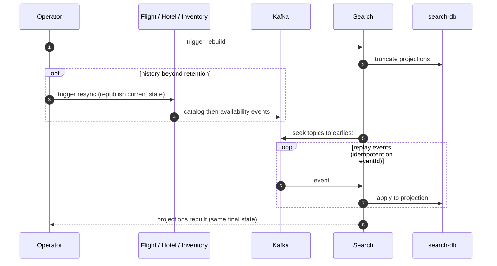

# Search — CQRS read models

Search is the read side of Atlas. It owns no business events and produces none — it is a
**terminal consumer** that folds **catalog** and **availability** facts into
query-optimized projections in its own `search-db`. Projections are event-sourced and can be
**rebuilt from Kafka** at any time.

> **Scope (as implemented in code).** Search maintains three projections —
> `FlightProjection`, `HotelProjection`, `RoomTypeNightAvailabilityProjection` — fed by two
> consumers: a **catalog** consumer (`flight.*`, `hotel.*`) and an **inventory
> availability** consumer (`inventory.flight.*`, `inventory.hotel.*`). It does **not**
> consume `booking.*` or `payment.*`, and there is no booking-history projection here.
> Booking history is served by the Booking service directly. (A `BookingProjection` appears
> in older specs but is not implemented — treat it as a future item.)

- [1. Read-model projection flow](#1-read-model-projection-flow)
- [2. Which events feed which projection](#2-which-events-feed-which-projection)
- [3. Rebuild from events](#3-rebuild-from-events)

---

## 1. Read-model projection flow

Each consumed event updates exactly one projection. Offers (flight/hotel search results) are
**computed per request** as live reads of the projections — there is no snapshot/offer table
and no TTL.

---

## 2. Which events feed which projection

> Availability events carry an **absolute** `reserved` value plus a monotonic `version`;
> Search applies them **last-writer-wins per resource key** (version guard), which makes
> out-of-order availability updates safe (ADR-0008 / ADR-0009).

---

## 3. Rebuild from events

Because projections are derived purely from catalog + availability events and consumers are
idempotent on `eventId`, the entire read model can be dropped and rebuilt by replaying the
topics — the basis of the read-model-rebuild experiment. When history is older than Kafka
retention, the catalog/inventory services **resync** by republishing current state from
their own DBs (ADR-0025/0026/0027).

