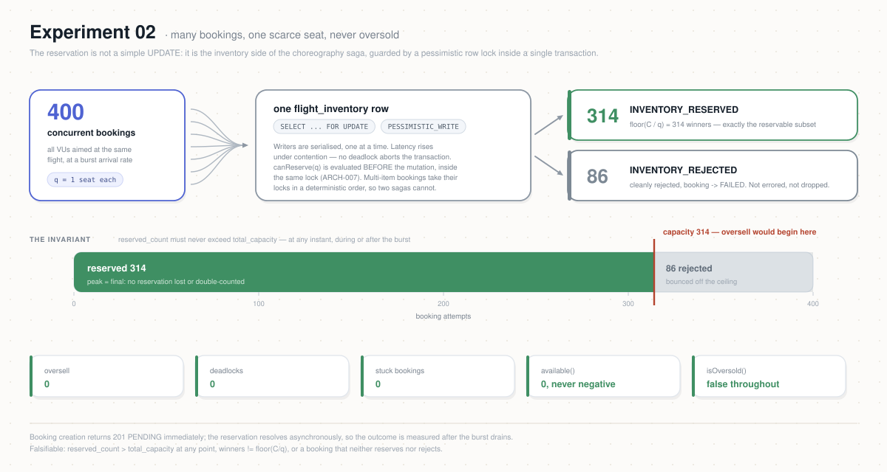

# Experiment 02 — Inventory Contention

**Category:** Correctness · **Type:** Load / concurrency
**Status:** ✅ **Runnable and passing** — 400 bookings against a 314-seat flight produced
exactly 314 winners and **no oversell** ([`RESULTS.md`](./RESULTS.md)).

> **New here? Start with [How to run](#how-to-run).** Everything above it is the *why* — the
> mechanism under test and the hypothesis. You do not need it to execute the experiment, but
> it is what makes the result mean something.

## Why this experiment

Experiment 01 proved the hot path *scales*. This one proves it stays *correct* while it
does. The single most important invariant of a booking platform is **no oversell**: two
travellers must never both win the last seat. In Atlas the reservation is not a simple
`UPDATE`; it is the Inventory side of the choreography Saga
(`features/reserve-inventory`, `ADR-0008`), guarded by a pessimistic row lock
(`SELECT … FOR UPDATE`) inside a single transaction. This experiment deliberately drives
**many concurrent bookings at one scarce resource** and asserts the invariant holds.

The mechanism under test lives in `inventory-service`:

- `FlightInventoryRepository.findForUpdate(...)` loads the row under
  `LockModeType.PESSIMISTIC_WRITE`, serializing concurrent reservations for the *same*
  flight (`state_machine.md §Concurrency`).
- `InventoryServiceImpl.reserve(...)` evaluates `canReserve(quantity)` and mutates
  `reservedCount` **inside** that lock, all-or-nothing across items and nights.
- The entity is defence-in-depth: `available() = max(0, totalCapacity − reservedCount)`,
  `reserve()` throws if it would exceed capacity, and `isOversold()` is the invariant
  (`totalCapacity < reservedCount`) that must **never** be true.
- Multi-item bookings lock resources in a deterministic order (sort by
  `resourceType`, then `resourceId`) to avoid deadlocks between concurrent Sagas.

Relevant rules/specs: `ARCH-007` (evaluate-before-mutate), `state_machine.md`
(concurrency + reservation transitions), `ADR-0008` (flight scalar vs hotel per-night
model), `inventory-events.yaml` (the `InventoryReserved` / `InventoryRejected` contract).

## Hypothesis

When `N` bookings compete concurrently for a single resource of capacity `C`, each
requesting `q` units:

1. **No oversell — the hard invariant.** `reservedCount` never exceeds `totalCapacity`
   at any instant; `available()` never goes negative. `isOversold()` is never true,
   during or after the burst.
2. **Exactly the reservable subset wins.** The number of bookings that reach
   `INVENTORY_RESERVED` equals `floor(C / q)`; every other booking is cleanly **rejected**
   (`INVENTORY_REJECTED`, booking → `FAILED`), not errored and not silently dropped.
3. **Conservation holds.** With payment stubbed to always-approve (reservations stay held),
   `reservedCount == winners × q` once the burst settles, and it equals the peak — no
   reservation is lost or double-counted under contention.
4. **Graceful serialization.** The lock serializes writers, so latency rises under
   contention but no deadlock aborts the transaction (deterministic lock ordering holds).

Falsifiable: if `reservedCount > totalCapacity` ever appears, or winners `≠ floor(C/q)`,
or a booking neither reserves nor rejects, the hypothesis fails.



## What it does

Unlike Experiment 01, which **spreads** load across the whole `ROUTES` table so inventory
is never the bottleneck, this experiment **concentrates** all virtual users on **one
target resource** with a small, known capacity, then fires a burst.

1. `setup()` picks a **single** contention resource (a flight with a known small
   `totalCapacity = C`, e.g. `C = 10`), discovered from a dedicated route/date reserved for
   this experiment (not shared with other runs).
2. All VUs run the checkout journey (`token → cart → add item(qty=q) → POST /bookings`)
   against **that same** resource, at a burst arrival rate with `N ≫ C` so they collide on
   the one locked row.
3. Booking creation returns `201 PENDING` immediately; the reservation is resolved
   asynchronously by the Saga. So the outcome is measured **after** the burst drains:
   - **Invariant read** — `GET /api/v1/inventory/flight/{flightId}` →
     assert `reservedCount ≤ totalCapacity` and `available ≥ 0`.
   - **Outcome tally** — for each `bookingId` created, `GET /api/v1/bookings/{bookingId}`
     → count `CONFIRMED`/reserved vs `FAILED`. Winners must equal `floor(C/q)`.
   - **Conservation** — `winners × q == reservedCount`.

### Variants (run each separately and compare)

| Variant | Params | Expected |
|---------|--------|----------|
| `unit` (default) | `C=10`, `q=1`, `N=100` | exactly 10 reserve, 90 reject, `reserved=10` |
| `partial` | `C=10`, `q=3`, `N=50` | 3 reserve (9 seats), 1 seat left unused, rest reject |
| `deadlock` (optional) | two shared flights A+B, each booking reserves **both**, opposite discovery order | no deadlock abort; lock-ordering holds; no oversell on either |

The `deadlock` variant specifically exercises the deterministic lock ordering in
`InventoryServiceImpl.reserve()`; skip it for the first pass and add once `unit`/`partial`
pass.

## Prerequisites

Shared setup from the [repo README](../README.md): `k6`, `.env`, the seeded user pool,
Grafana. Plus, specific to this experiment — [How to run](#how-to-run) walks through
setting these up:

- A **contention target**: a route/date (or city) that exposes **exactly one** in-stock
  flight/room-type, pinned via `CONTENTION_*`. Either reuse an existing seeded flight
  (`load.js` reads its capacity live — just set `N ≫ C/q`) or seed a dedicated
  small-capacity one for isolation. Keep it off Experiment 01's `ROUTES` so runs don't
  contaminate each other.
- **Payment stubbed to always-approve** (WireMock — the stub already exists in
  `deploy/platform/apps/wiremock.yaml`) so winning reservations stay `RESERVED`/`CONFIRMED`
  and the settled `reservedCount` is stable to read. If payment fails/times out it would
  *release* stock and mask the invariant we want to observe.
- Reservation **TTL long enough** to outlast the burst + verification (otherwise the TTL
  sweep expires winners mid-measurement); check `ReservationExpirationProperties.ttl`.

## What's built

Everything needed to run the `unit` variant end to end. Kept here because it maps each
moving part to the file that implements it — useful when a run misbehaves and you need to
know where to look.

1. ✅ **Harness single-resource "pin" mode.** `lib/k6/booking.js` →
   `resolveContentionOffer(scenario)` resolves **exactly one** offer from the
   `CONFIG.contention` target (env `CONTENTION_ORIGIN/DESTINY/DATE/CITY`, optional
   `CONTENTION_RESOURCE_ID` to disambiguate). Additive — Experiment 01 is untouched.
2. ✅ **`load.js`.** Burst executor (`shared-iterations`, `N` bookings across up-to-pool VUs)
   pinned to the target, reusing `lib/k6/{auth,cart,booking}.js`.
3. ✅ **Verify step** — `teardown()` in `load.js` reads the inventory ground truth
   (`lib/k6/inventory.js` → `GET /inventory/{flight,hotel}/…`, authenticated, no ownership
   check so `loadtest-1` can read the shared resource), asserts **no oversell**
   (`reservedCount ≤ totalCapacity`) and **winners == `floor(C/q)`**, and **throws** (fails
   the run) on violation. Capacity `C` is read **live** in `setup()`, not assumed.

4. ✅ **A target resource + always-approve payment.** Resolved by **reusing an existing
   seeded flight** — `load.js` reads its capacity live in `setup()`, so any flight works
   provided you set `N` well above `C/q`. The recorded run used a 314-seat flight and
   `N=400`. Payment is stubbed always-approve via WireMock
   (`deploy/platform/apps/wiremock.yaml`) so winners stay reserved and the settled count is
   stable to read.
5. ✅ **Grafana observation + custom metrics.** Inventory now exposes
   `atlas_inventory_reservations_total{result}`, `atlas_inventory_oversell_attempts_total`,
   and `atlas_inventory_units_total{action}` (ADR-0018), and a dedicated dashboard plots them
   alongside consumer lag and the k6 side. See *What to watch* below.
6. ✅ **A dirty-start guard.** `load.js` refuses to run if the target is already oversold or
   has no reservable stock, so a bad starting state fails fast instead of producing a
   misleading result.

**Not yet run:** the `partial` (`Q=3`) and `deadlock` variants. See
[`RESULTS.md`](./RESULTS.md) for what they should produce.

## How to run

### 0. Load the config, and check the cluster answers

```bash
cd experiments/02-inventory-contention

export LB=<ingress EXTERNAL-IP>                 # kubectl get svc -A | grep LoadBalancer
eval "$(../scripts/cluster-credentials.sh)"     # the three secrets, read live from the cluster
set -a; source ../.env; set +a                  # the non-secret knobs
```

Take the credentials from the cluster rather than pasting them into `.env` — see
[Auth for load tests](../README.md#auth-for-load-tests). A `.env` with hand-copied secrets
goes stale the moment the realm is re-imported (Keycloak regenerates the `atlas-loadtest`
client secret), and the failure then looks like a load-test bug rather than a config drift.

**If that curl does not print `200`, k6 will fail too** — as
`Token request failed … 0 null`. Status `0` is k6's way of saying *no HTTP response arrived
at all*, so it is a connectivity problem, never an auth one. Three things produce it, in
rough order of likelihood:

| What you see | Cause | Check |
|---|---|---|
| `curl` hangs, then times out | ingress or Keycloak is down — including apps deliberately idled between runs | `kubectl -n atlas-system get pods \| grep keycloak` |
| `Could not resolve host` | the `nip.io` name isn't resolving — either `KEYCLOAK_URL` no longer matches the LoadBalancer IP (the hostname embeds it, so a redeploy silently breaks the URL), or your resolver blocks `nip.io`, which some corporate and ISP DNS does | `dig +short keycloak.$LB.nip.io` — must return `$LB` |
| `Connection refused` | the host resolves but nothing is listening — usually the ingress controller | `kubectl get svc -A \| grep LoadBalancer` |

A **401** here is a different animal entirely: Keycloak answered and rejected you. That one
*is* auth config — wrong client secret, Direct Access Grants off, or the user pool not
seeded. `lib/k6/auth.js` distinguishes the two cases and tells you which you have.

### 1. Pick the ONE scarce resource

The experiment pins every VU onto a single flight (or room type). It must resolve to
**exactly one** in-stock resource — `load.js` refuses to guess, and fails with a clear
message if zero or several match.

Any seeded flight works: `setup()` reads its capacity `C` live from the inventory API, so
you never hard-code it. Just make sure `N` is comfortably larger than `C/q`. Check 
the availability for flights with the script below, pick origin/destination/departureDate from 
 `ROUTES array` in ([config.js](../lib/k6/config.js)).

> **The search endpoint is public** — `GET /api/v1/search/flights` and `/search/hotels` are
> `permitAll` in search-service's `SecurityConfig`. No token needed for this step; you only need
> `$ATLAS_GATEWAY`.

```bash
# Pick an origin / destination / departureDate from the ROUTES array in lib/k6/config.js.
ORIGIN=ATH
DESTINATION=DUB
DATE=2027-01-02

curl -sS "$ATLAS_GATEWAY/api/v1/search/flights?origin=$ORIGIN&destination=$DESTINY&departureDate=$DATE&adults=1&size=50" \
  | jq '[.content[] | select(.available > 0) | {flightId, available, basePrice}]'
```

Read the output as a count — that is the whole question this step asks:

| Result | Meaning | What to do |
|---|---|---|
| `[]` | no stock on that route/date | pick another `ROUTES` entry |
| one entry | ✅ exactly what the experiment needs | export the three vars below, and set `N` well above `available` |
| several entries | ambiguous — `load.js` refuses to guess | also export `CONTENTION_RESOURCE_ID` with one of the `flightId`s |

```bash
export CONTENTION_ORIGIN=$ORIGIN CONTENTION_DESTINY=$DESTINY CONTENTION_DATE=$DATE
# several matched? disambiguate:
# export CONTENTION_RESOURCE_ID=<flightId from the list above>
```

The `available` figure it prints is the capacity the burst will compete for, so use it to choose
`N`: aim for **at least 1.5×** it, or `setup()` will refuse to start (there would be no losers,
so nothing would test the rejection path).

<details>
<summary>Hotel target instead (<code>SCENARIO=hotel</code>)</summary>

Hotels are searched by city and a stay range rather than a route, and the offers are nested one
level deeper — a hotel per `content` entry, room types inside it:

```bash
CITY=Dublin
CHECKIN=2027-01-02
CHECKOUT=2027-01-04          # checkIn + SEARCH_NIGHTS

curl -sS "$ATLAS_GATEWAY/api/v1/search/hotels?city=$CITY&checkIn=$CHECKIN&checkOut=$CHECKOUT&rooms=1&guests=2&size=50" \
  | jq '[.content[] | .rooms[]? | select(.roomsAvailable > 0) | {roomTypeId, roomsAvailable, pricePerNight}]'

export SCENARIO=hotel CONTENTION_CITY=$CITY CONTENTION_DATE=$CHECKIN
# export CONTENTION_RESOURCE_ID=<roomTypeId>   # if several matched
```

`rooms` and `guests` are both `@NotNull`, same trap as `adults` on the flight side.
</details>

### 2. Fire the burst

```bash
# unit contention: N >> C, expect exactly floor(C/1) winners, the rest rejected
k6 run -e N=400 load.js

# partial: q=3 units per booking
k6 run -e N=50 -e Q=3 load.js
```

The run **fails loudly (non-zero exit)** if the invariant breaks — you do not have to read
the output to know whether it passed. Record what you got in [`RESULTS.md`](./RESULTS.md).

Knobs (env): `N` (bookings fired at the resource), `Q` (units per booking = `q`),
`SETTLE` (seconds to wait for the Saga before verifying, default 45), `MAX_VUS`
(concurrency, capped by the pool), `CONTENTION_*` (which resource to pin), `SCENARIO`
(`flight`|`hotel`). `C` (capacity) is **not** a knob — `setup()` reads it live from the
inventory API and derives the expected winners. The run **fails loudly** (non-zero exit) if
`reservedCount > totalCapacity` or winners `≠ floor(C/q)`.

## What to watch (Grafana)

A dedicated dashboard ships with this experiment: **Atlas — Experiment 02: Inventory
Contention** (`deploy/platform/observability/atlas-exp02-dashboard.yaml`). It plots the
custom inventory meters added for this work (ADR-0018) plus the k6 side.

| Layer | Panel / query | Healthy signal |
|-------|---------------|----------------|
| Invariant | `atlas_inventory_oversell_attempts_total` (stat) | **stays 0** — any increment means the reserve guard tripped (oversell) |
| Outcome | `atlas_inventory_reservations_total{result}` (reserved vs rejected) | reserved plateaus at `floor(C/q)`; rejected absorbs the rest |
| Units | `atlas_inventory_units_total{action}` (reserved vs released) | released ~0 during the run (payment always-approve); else winners are being freed |
| Kafka | `kafka_consumergroup_lag{topic="booking.created"}` | spikes during the burst, **drains to ~0** after |
| Load side | `k6_oversell` / `k6_bookings_created` (needs `PROM=1`) | `k6_oversell` 0; `bookings_created` ≈ `N` |

### Observability setup

```bash
# Grafana → folder "Atlas" → "Atlas — Experiment 02: Inventory Contention":
kubectl -n atlas-observability port-forward svc/kps-grafana 3000:80        # admin / atlas-admin
```

## Success criteria

- **`isOversold()` is never true** — `reservedCount ≤ totalCapacity` throughout; `available`
  never negative. (Primary; a single breach fails the experiment.)
- Winners reaching `INVENTORY_RESERVED` = `floor(C / q)`; all other bookings `FAILED` via
  `INVENTORY_REJECTED`; none left `PENDING`.
- Conservation: `winners × q == reservedCount` once settled (with payment always-approve).
- No deadlock-aborted transactions under the `deadlock` variant.

## Results

Record each run in [`RESULTS.md`](./RESULTS.md). When a run surfaces a change (a lock
tuning, an isolation-level decision, a contract adjustment), capture the reasoning in a
`<topic>.md` findings doc in this folder, and promote binding cross-service decisions to
ADRs (`DR-002`) — same convention as Experiment 01.

Findings/decisions so far:

- [`inventory-observability.md`](./inventory-observability.md) — the custom inventory metrics
  added to measure the invariant, recorded as
  [ADR-0018](../../docs/adr/ADR-0018-inventory-contention-metrics.md).
