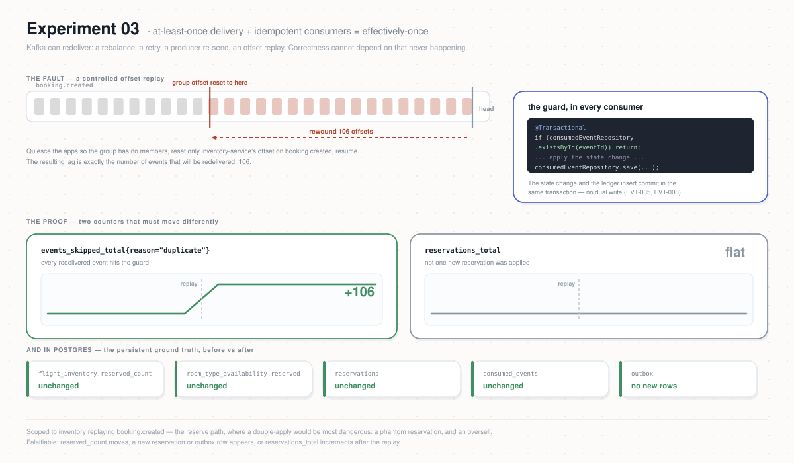

# Experiment 03 — Duplicate Messages / Idempotency

**Category:** Correctness · **Type:** Fault-injection (Kafka replay) · **Status:** DONE

## Why this experiment

Atlas is an event-driven Saga over Kafka, and Kafka gives **at-least-once** delivery: a
consumer can see the same event more than once (rebalance, retry, offset replay, a producer
re-send). For the system to be correct, consumers must be **idempotent** — reprocessing an
event must have no additional effect. At-least-once delivery + idempotent consumers =
**effectively-once**. This experiment demonstrates that property instead of asserting it.

The mechanism under test lives in every Atlas consumer and is explicit in
`inventory-service` (`InventoryServiceImpl`): each handler is `@Transactional` and starts with

```java
if (consumedEventRepository.existsById(eventId)) { /* skip */ return; }
… apply the state change …
consumedEventRepository.save(new ConsumedEvent(eventId, type));
```

The state change **and** the `consumed_events` insert commit in the same transaction (no
dual-write), so a redelivered `eventId` is a guaranteed no-op (`EVT-005`, `EVT-008`). This
experiment scopes to **inventory replaying `booking.created`** — the reserve path, where a
double-apply would be the most dangerous (a phantom double reservation → oversell).

## Hypothesis

When already-processed `booking.created` events are **redelivered** to `inventory-service`
(by resetting its consumer-group offset backwards), the service reprocesses none of them:

1. **No new side effects.** No new reservations; `flight_inventory.reserved_count` and the
   per-night `room_type_availability.reserved` are **unchanged**; no new resource/booking
   events are written to the outbox.
2. **Dedup is provable.** Every redelivered event is skipped by the idempotency guard —
   `atlas_inventory_events_skipped_total{reason="duplicate"}` rises by exactly the number of
   events replayed, while `atlas_inventory_reservations_total` does **not** move.
3. **The ledger is stable.** `consumed_events` row count is unchanged (the ids were already
   recorded); no duplicate rows.

Falsifiable: if `reserved_count` changes, or a new reservation/outbox row appears, or
`reservations_total{result="reserved"}` increments after the replay, idempotency failed.



## What it does

`runbook.sh` performs a controlled **offset replay** — the faithful shape of at-least-once
redelivery — using the same cluster levers as `reset-state.sh`:

1. **Precondition:** there must already be processed `booking.created` events to replay (run
   Experiment 01/02 or `make smoke` first). The runbook refuses to run if `consumed_events`
   is empty.
2. **Snapshot BEFORE** (Postgres — the persistent ground truth): `consumed_events` count,
   `reservations` count, `sum(reserved_count)`, `sum(room_type_availability.reserved)`,
   `outbox` count. Also record the `inventory-service` group's lag on `booking.created`.
3. **Quiesce** the apps (`deploy/ops/apps/idle.sh`) so the `inventory-service` group has no
   active members — a precondition for an offset reset.
4. **Replay:** reset **only** the `inventory-service` group's offset on `booking.created`
   backwards (`--shift-by -N`, or `--to-earliest` with `--all`). The resulting lag = the
   number of events that will be redelivered.
5. **Resume** the apps (`deploy/ops/apps/resume.sh`); `inventory-service` re-consumes the
   replayed `booking.created` events and dedups them.
6. **Snapshot AFTER** once lag drains, and assert the hypothesis.

> **Counters reset on restart.** Micrometer counters are per-process, so quiescing restarts
> `inventory-service` and its counters start at 0. That is *by design* here: read **after**
> the replay, `atlas_inventory_events_skipped_total` equals the events redelivered and
> `atlas_inventory_reservations_total{result="reserved"}` is **0** — a clean, direct readout
> of "the replay caused only skips." The persistent invariants (§Postgres) carry the
> before/after comparison.

## Prerequisites

- Shared setup from the [repo README](../README.md): `kubectl` context on the Atlas cluster.
- **Processed `booking.created` events already on the topic** (a prior Exp 01/02 run, or
  `make -C .. smoke EXP=02-inventory-contention N=20`). No new load should run *during* the
  experiment (it would add non-duplicate events and muddy the readout).
- `inventory-service` built with the duplicate-skip meter (ADR-0019) for the visible-dedup
  half; the Postgres assertions work regardless.

## How to run

```bash
cd experiments/03-duplicate-messages-idempotency
# preview everything, change nothing:
DRY_RUN=1 ./runbook.sh
# execute the replay (destructive to offsets only — never wipes data):
CONFIRM=yes ./runbook.sh                    # default: --shift-by -50 on booking.created
CONFIRM=yes REPLAY_N=200 ./runbook.sh       # replay more
CONFIRM=yes REPLAY_ALL=1 ./runbook.sh       # --to-earliest (replay the whole topic)
```

Env knobs: `REPLAY_N` (offsets to shift back per partition, default 50), `REPLAY_ALL=1`
(replay from earliest instead), `TOPIC` (default `booking.created`), `GROUP` (default
`inventory-service`), `SETTLE` (seconds to wait for catch-up), `DRY_RUN`, `CONFIRM`.

## What to watch (Grafana)

Reuse the **Atlas — Experiment 02** dashboard (the meters are shared):

| Layer | Panel / query | Healthy signal |
|-------|---------------|----------------|
| Dedup | `atlas_inventory_events_skipped_total{reason="duplicate"}` | rises to = events replayed, after resume |
| No side effect | `atlas_inventory_reservations_total{result="reserved"}` | **0** after the replay (no new reservations) |
| No side effect | `atlas_inventory_oversell_attempts_total` | stays 0 |
| Kafka | `kafka_consumergroup_lag{topic="booking.created"}` | spikes to the replay depth, drains to ~0 |

## Success criteria

- `flight_inventory.reserved_count` (and `room_type_availability.reserved`) **unchanged**
  before vs after — no double reservation.
- `consumed_events` count and `reservations` count **unchanged**; `outbox` count unchanged.
- After resume: `atlas_inventory_events_skipped_total` == events replayed, and
  `atlas_inventory_reservations_total{result="reserved"}` == 0.
- No `oversell_attempts`.

## Results

Record each run in [`RESULTS.md`](./RESULTS.md). Findings/decisions:

- [`idempotency-metrics.md`](./idempotency-metrics.md) — the duplicate-skip meter added to
  make dedup visible, recorded as
  [ADR-0019](../../docs/adr/ADR-0019-inventory-idempotency-metrics.md).
