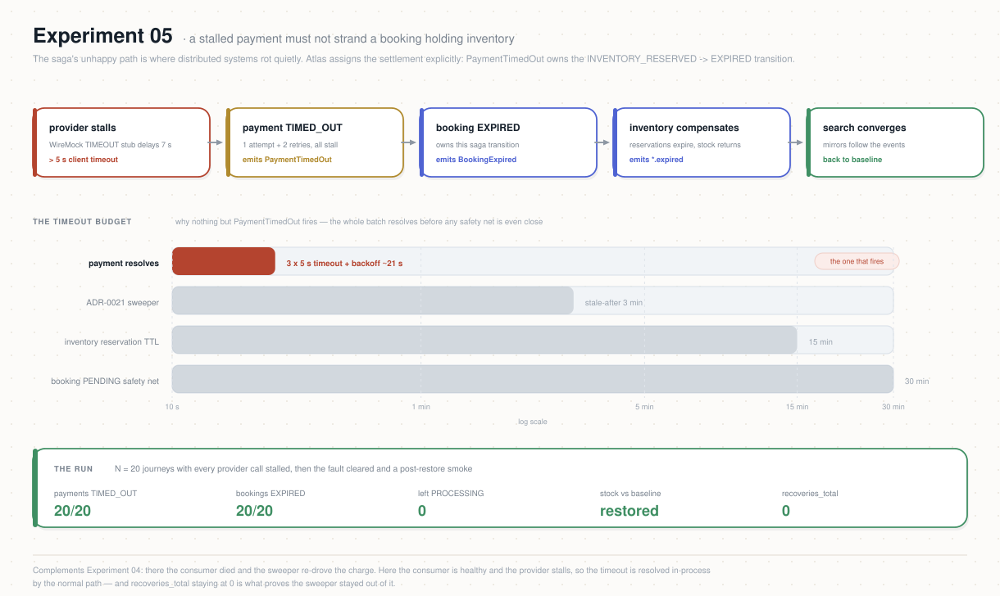

# Experiment 05 — Payment Timeout → Compensation

**Category:** Resilience · **Type:** Fault-injection (provider stall) · **Status:** ready to run

## Why this experiment

The Saga's unhappy path is where distributed systems rot quietly: a payment that never
resolves must not strand a booking holding inventory forever. Atlas assigns this settlement
explicitly (*Timeout Ownership*, `features/booking-expiration`): a stalled **provider** is
detected by payment's own call policy (5 s per attempt × 3 attempts, `services/payment` —
outcome `TIMED_OUT`), which emits `PaymentTimedOut` — the one event that owns the
`INVENTORY_RESERVED → EXPIRED` transition. Booking then emits `BookingExpired`, and inventory
**compensates**: reservations expire, stock returns, and the resource-level `*.expired`
events update the Search read model. This experiment demonstrates that whole chain — payment
stall → timeout → expiry → compensation → stock restored — instead of asserting it.

It complements Experiment 04: there the *consumer* died and recovery re-drove the charge
(ADR-0021); here the consumer is healthy and the *provider* stalls — the timeout is resolved
in-process by the normal path, and the sweeper must stay out of it entirely.

## Hypothesis

When every provider call stalls past the client timeout (WireMock `TIMEOUT` scenario: 7 s
delay > 5 s timeout) during a controlled batch of N bookings:

1. **Every payment times out cleanly.** All N payments end `TIMED_OUT` after exactly the
   policy's attempts (1 + 2 retries), each emitting `PaymentTimedOut`. No payment is stuck
   `PROCESSING`; `atlas_payment_recoveries_total` stays **0** (the normal path, not the
   ADR-0021 sweeper, resolves the stall).
2. **The Saga compensates completely.** All N bookings end `EXPIRED` (via
   `PaymentTimedOut` → `BookingExpired`); every reservation of the batch leaves `RESERVED`;
   `flight_inventory.reserved_count` and `room_type_availability.reserved` return exactly to
   the pre-batch baseline; the Search mirrors (`flight_projections.reserved`, per-night
   `room_type_availability.reserved`) converge to the same baseline.
3. **The system heals when the fault clears.** With the scenario restored, a post-fault smoke
   of `SMOKE_N` bookings confirms end-to-end (`CONFIRMED`, payments `SUCCEEDED`) — no residue
   from the fault window.

Falsifiable: a booking stuck in `INVENTORY_RESERVED`, a payment left `PROCESSING`, stock or
read-model sums that do not return to baseline, any `recoveries_total` > 0, or a failed
post-restore smoke.



## What it does

`runbook.sh` orchestrates the window:

1. **Guardrails + clean start** (kubectl context, lag 0, no other load).
2. **Snapshot BEFORE:** stock sums (inventory + search mirrors), bookings/payments counts.
3. **Inject the fault:** `ATLAS_PAYMENT_PROVIDER_SCENARIO=TIMEOUT` on the payment
   Deployment (Spring relaxed binding → `atlas.payment.provider.scenario` → forwarded as
   `X-Payment-Scenario` on every charge; WireMock's TIMEOUT stub delays 7 s). Waits for the
   rollout. A trap guarantees the env var is removed even if the runbook dies mid-way.
4. **Fire the batch:** N journeys via k6 (Exp 01 `load.js`, smoke mode). Each payment burns
   ~19–21 s of a consumer thread (3 × 5 s timeouts + backoff), so the batch drains slowly by
   design — keep N modest.
5. **Settle:** waits until the `payment-service` lag is 0, every batch payment is terminal,
   every batch booking leaves the in-flight states, and the stock/read-model sums converge
   back to the baseline (polling — the Search mirror is eventually consistent).
6. **Restore:** removes the env var, waits for the rollout back to the normal scenario.
7. **Post-restore smoke:** `SMOKE_N` journeys must confirm end-to-end.
8. **Verdict:** asserts hypothesis §1–§3 against Postgres; prints the meters to record.

> **Timeout-budget sanity.** The whole batch resolves in ~1–3 min — far below inventory's
> reservation TTL (15 m) and booking's PENDING safety-net (30 m), so neither safety net fires
> during the window; the compensation observed is driven purely by `PaymentTimedOut`.
> The ADR-0021 sweeper (stale-after 3 m) also never triggers because payments resolve
> in-process in ~21 s.

## Prerequisites

- Shared setup from the [repo README](../README.md): k6, `.env` loaded, `kubectl` context,
  seeded load-test users, seeded inventory for the configured `SCENARIO`.
- WireMock deployed with the repo's `wiremock/mappings/payment-provider.json` (it defines the
  `TIMEOUT` scenario stub).
- `payment-service` built with the ADR-0020 meters (for the visible readout; the Postgres
  assertions work regardless).
- No other load running during the experiment (it would book against the fault window).

## How to run

```bash
cd experiments/05-payment-timeout-compensation
set -a; source ../.env; set +a
# preview everything, change nothing:
DRY_RUN=1 ./runbook.sh
# execute (all payments time out for the duration of the batch):
CONFIRM=yes ./runbook.sh                 # defaults: N=20 VUS=5 SMOKE_N=3
CONFIRM=yes N=40 VUS=8 ./runbook.sh
```

Env knobs: `N` (batch journeys, default 20 — each occupies a payment consumer ~21 s, keep it
modest), `VUS` (parallel journeys, default 5), `SMOKE_N` (post-restore smoke size, default 3),
`SETTLE` (seconds for compensation + read model to converge, default 300), `SCENARIO`
(k6 passthrough: flight | hotel | both), `DRY_RUN`, `CONFIRM`.

## What to watch (Grafana)

A dedicated dashboard ships with this experiment: **Atlas — Experiment 05: Payment Timeout →
Compensation**
(`deploy/platform/observability/atlas-exp05-dashboard.yaml`). On the GitOps path it is installed at
cluster bootstrap by the `obs-config` Application; otherwise apply it once:

```bash
kubectl apply -f deploy/platform/observability/atlas-exp05-dashboard.yaml
kubectl -n atlas-observability port-forward svc/kps-grafana 3000:80    # admin / atlas-admin
```

The panel that matters is **Inventory units /s — reserved vs released**: the release
curve chasing the reserve curve *is* the compensation, and the areas under the two must match.
`atlas_payment_recoveries_total` must stay 0 — if the sweeper fired, the normal timeout path
did not resolve the stall. The table below adds the rest.

| Layer | Panel / query | Healthy signal |
|-------|---------------|----------------|
| Payment | `atlas_payment_provider_calls_total{outcome="timeout"}` | == N by the end of the batch (fresh pods: counters start at 0 after the fault rollout) |
| Payment | `atlas_payment_recoveries_total` | stays **0** — the sweeper never intervenes |
| Saga | `kafka_consumergroup_lag{consumergroup="payment-service"}` | builds during the slow-drain batch, back to 0 |
| Compensation | `atlas_inventory_units_total{action="released"}` | rises by the batch's reserved units as expirations land |
| Correctness | `atlas_inventory_oversell_attempts_total` | stays 0 |
| Read model | Search reserved sums (or the Exp 02 dashboard) | return to baseline after the batch |

## Success criteria

- Batch: bookings `EXPIRED` == N; payments `TIMED_OUT` == N; 0 payments `PROCESSING`;
  0 batch reservations left `RESERVED`.
- Stock: `sum(reserved_count)` (flights) and `sum(reserved)` (hotel nights) equal the
  pre-batch baseline; Search mirrors converge to the same values.
- `atlas_payment_provider_calls_total{outcome="timeout"}` == N and `recoveries_total` == 0.
- Post-restore smoke: `SMOKE_N` bookings `CONFIRMED`, payments `SUCCEEDED`.

## Results

Record each run in [`RESULTS.md`](./RESULTS.md).
