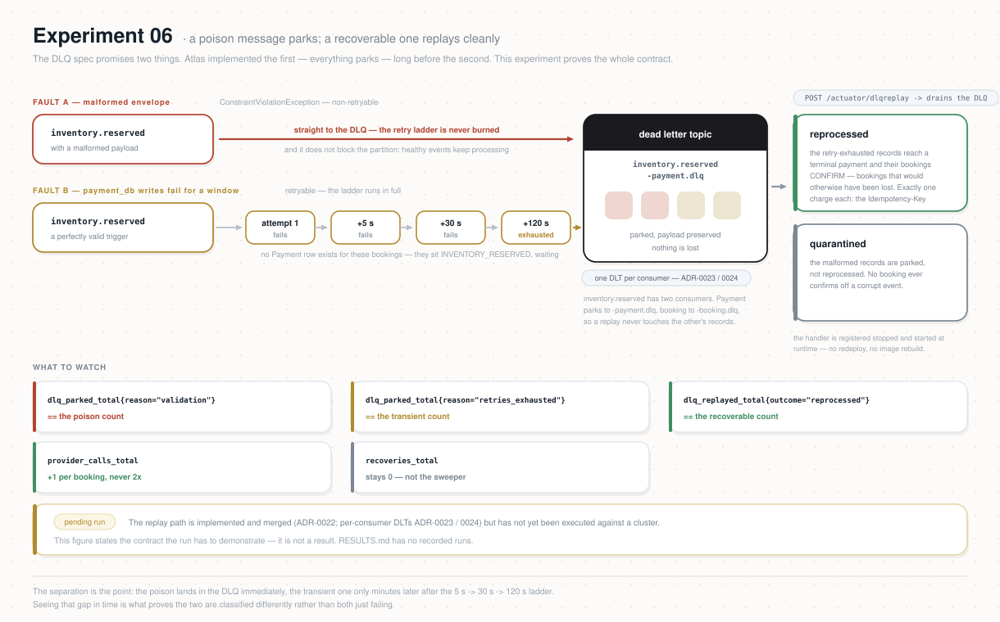

# Experiment 06 — DLQ Recovery

**Category:** Resilience · **Type:** Fault-injection (poison message + transient outage) ·
**Status:** READY (pending deploy) — replay path merged
([ADR-0022](../../docs/adr/ADR-0022-payment-dlq-replay.md)); Scenario B DB-write fault lever
defined below; runbook verdict assertions to finalize on the first real run

## Why this experiment

`dlq-strategy.md` (SPEC-KAFKA-DLQ) promises two things: unprocessable messages **park** in a
Dead Letter Topic, and parked messages **can be manually replayed** with their payload
preserved. Atlas today implements only the first — every consumer parks to `<topic>.dlq`, but
`autoStartDltHandler="false"` with no `@DltHandler`, no admin control and no tooling means
nothing ever reads a `.dlq` back. This experiment proves the whole contract on the highest-value
target (**payment-service**): a poison message and a retry-exhausted message both park, and only
the *recoverable* one replays cleanly — completing a booking that would otherwise be lost —
while the genuinely poison one stays quarantined. It closes a real liveness gap one step earlier
in the pipeline than the ADR-0021 sweeper (retries-exhausted-*before*-TX1 vs.
crash-*between*-TX1-and-TX2). Spec: `dlq-strategy.md`, `retry-strategy.md`, `services/payment`.

> **Depends on a change.** The in-app replay handler + DLQ meters are implemented
> ([ADR-0022](../../docs/adr/ADR-0022-payment-dlq-replay.md), payment-service). The DLT handler is
> registered stopped (`autoStartDltHandler="false"`) and started **at runtime, no redeploy**, via
> `POST /actuator/dlqreplay {"action":"start"}` (and `"stop"` when drained) — the runbook drives it
> through the k8s API proxy. Pending before a passing run: build/deploy the image. The Scenario B
> `payment_db`-write fault lever is defined below and wired into the runbook. Reasoning in
> [`dlq-replay-payment.md`](./dlq-replay-payment.md).

> **Per-consumer DLQ (ADR-0023/0024).** `inventory.reserved` is consumed by both payment and
> booking, so their retry/DLT topics are namespaced per consumer: payment parks to
> `inventory.reserved-payment.dlq`, booking to `inventory.reserved-booking.dlq`. This experiment
> targets payment's DLQ only — so a poison message contributes exactly one record here (booking's
> copy lands on its own DLQ), and payment's replay never touches booking's parked records. (The
> first Exp 06 run surfaced this: a shared `.dlq` had doubled the poison count and mixed the two
> services — see [`dlq-replay-payment.md`](./dlq-replay-payment.md).)

## Hypothesis

During a controlled batch of N bookings, with two faults injected against payment-service:

1. **Poison parks, does not retry.** A malformed `inventory.reserved` envelope (fails
   validation → `ConstraintViolationException`, non-retryable) lands on `inventory.reserved-payment.dlq`
   **immediately**, without burning the retry ladder. `atlas_payment_dlq_parked_total{reason=
   "validation"}` == the number injected. It does **not** block the partition — healthy events
   keep processing.
2. **Transient failure exhausts retries, then parks.** With `payment_db` writes made to fail
   for a window (retryable), the affected triggers exhaust all 4 attempts (5s → 30s → 120s) and
   land on the DLQ. `atlas_payment_dlq_parked_total{reason="retries_exhausted"}` == that count;
   **no `Payment` row exists** for those bookings; those bookings sit `INVENTORY_RESERVED`.
3. **Replay recovers only the recoverable — exactly once.** After the transient fault clears,
   starting the DLT handler drains `inventory.reserved-payment.dlq`:
   - the retry-exhausted records **reprocess** to a terminal payment and their bookings reach
     `CONFIRMED` (or `FAILED`/`EXPIRED` on a genuine provider outcome) —
     `atlas_payment_dlq_replayed_total{outcome="reprocessed"}` == that count, and
     `atlas_payment_provider_calls_total` rises by **exactly one charge per booking** (never
     2× — the `Idempotency-Key` guarantee); `atlas_payment_recoveries_total` stays **0** (the
     sweeper is not what settled them);
   - the malformed records are **quarantined**, not reprocessed —
     `atlas_payment_dlq_replayed_total{outcome="quarantined"}` == the poison count, and their
     bookings never confirm off a malformed event.

Falsifiable: a poison message that retries before parking or blocks the partition; a
retry-exhausted booking that a background process silently completes or that stays stuck after
replay; any double charge on replay; `recoveries_total > 0`; or a malformed message that
"succeeds" on replay.



## What it does

`runbook.sh` orchestrates the window (mirrors Exp 04/05):

1. **Guardrails + clean start:** kubectl context checks; `payment-service` group lag on
   `inventory.reserved` starts at 0; verify the deployed image exposes the ADR-0022 DLQ meters
   (else abort — the assertions depend on them); no other load.
2. **Snapshot BEFORE** (Postgres ground truth): payments/bookings counts, DLQ end offsets,
   stock + search-mirror baselines.
3. **Scenario A — poison:** publish `POISON_N` malformed `inventory.reserved` envelopes directly
   to the topic; assert they appear on `inventory.reserved-payment.dlq` immediately (parked meter +
   backlog gauge), and a concurrent healthy smoke still confirms (partition not blocked).
4. **Scenario B — transient outage:** make `payment_db` writes fail for the window (fault
   toggle), fire N journeys via k6 (Exp 01 `load.js` smoke mode), wait for the affected triggers
   to exhaust retries onto the DLQ; assert parked meter + no `Payment` rows + bookings
   `INVENTORY_RESERVED`.
5. **Clear the fault** (drop the trigger), confirm `payment_db` writes are healthy.
6. **Replay:** `POST /actuator/dlqreplay {"action":"start"}` (via the k8s API proxy — no redeploy)
   to start the DLT handler and drain `inventory.reserved-payment.dlq`; it **auto-stops** once the queue is
   idle (redrive semantics). The runbook waits for the auto-stop, then issues an idempotent `stop`
   as a safety net.
7. **Verdict:** assert hypothesis §1–§3 against Postgres + the meters; print the readout for
   RESULTS.

## Prerequisites

- Shared setup from the [repo README](../README.md): k6, `.env` loaded, `kubectl` context,
  seeded load-test users, seeded inventory for the configured `SCENARIO`.
- **payment-service built with ADR-0022** (the `@DltHandler` replay path + `atlas_payment_dlq_*`
  meters + the `dlqreplay` actuator endpoint). Confirm the *deployed* image is post-ADR-0022
  (pushed commit + CI + rollout are separate steps). The DLQ meters are lazy (absent until the
  first parked/replayed record), so they only appear *after* the replay step — read them from the
  pod that ran the handler at the verdict, per the ADR-0020 restart caveat.
- WireMock deployed with the repo's `payment-provider.json` mappings (for the post-replay
  provider outcomes).
- No other load running during the experiment. The Scenario B DB-write fault lever is
  self-contained in the runbook (see below); a trap always reverses it.

### The Scenario B fault lever — a transient `payment_db` write outage

"Make `payment_db` writes fail" is implemented as a **`BEFORE INSERT` trigger on
`payment_db.payments`** that raises an I/O-class error (SQLSTATE `58030`). Every attempt to
`INSERT` a `Payment` aborts, so TX1 (`beginProcessing`) rolls back and:

- the consumer sees a **retryable** error — `58030` is *not* in the `@RetryableTopic` exclude
  set (only `ConstraintViolation` / `IllegalArgument` / `InvalidPaymentStateTransition` are), so
  the trigger event walks the full 5 → 30 → 120 s ladder and then **parks in the DLQ**; and
- **no `Payment` row is ever created** — reproducing the exact gap ADR-0022 closes: a parked
  trigger the ADR-0021 sweeper can't help with, because there is no `PROCESSING` payment to find.

It is deliberately **surgical** (only `INSERT`s into `payments`; reads, the outbox relay and every
other service keep working) and **instantly reversible** (`DROP TRIGGER`). It emulates a transient
write outage — e.g. the primary briefly rejecting writes — deterministically, without touching the
cluster's storage or networking. The runbook applies it (`apply_db_write_fault`), fires the batch,
waits `RETRY_DRAIN`, then clears it (`clear_db_write_fault`); a trap drops it even if the run dies.

## How to run

```bash
cd experiments/06-dlq-recovery
set -a; source ../.env; set +a
# preview everything, change nothing:
DRY_RUN=1 ./runbook.sh
# execute:
CONFIRM=yes ./runbook.sh                      # defaults: N=20 VUS=5 POISON_N=3
CONFIRM=yes N=40 VUS=8 POISON_N=5 ./runbook.sh
```

Env knobs (planned): `N` (batch journeys, default 20), `VUS` (parallel, default 5), `POISON_N`
(malformed messages, default 3), `SETTLE` (seconds for replay + Saga to converge, default 300),
`RETRY_DRAIN` (seconds to wait for the retry ladder to reach the DLQ, ≥ 155s = 5+30+120),
`SCENARIO` (k6 passthrough), `DRY_RUN`, `CONFIRM`.

## What to watch (Grafana)

A dedicated dashboard ships with this experiment: **Atlas — Experiment 06: DLQ Recovery**
(`deploy/platform/observability/atlas-exp06-dashboard.yaml`). On the GitOps path it is installed at
cluster bootstrap by the `obs-config` Application; otherwise apply it once:

```bash
kubectl apply -f deploy/platform/observability/atlas-exp06-dashboard.yaml
kubectl -n atlas-observability port-forward svc/kps-grafana 3000:80    # admin / atlas-admin
```

Look for the **time gap** in *Parked /s by reason*: poison parks instantly, retry-exhausted
only appears minutes later after the 5s → 30s → 120s ladder. Seeing that separation is
hypothesis 1. Then check the provider calls rise by exactly one charge per reprocessed booking
during replay. The table below adds the rest.

| Layer | Panel / query | Healthy signal |
|-------|---------------|----------------|
| DLQ backlog | `kafka_topic_partition_current_offset{topic="inventory.reserved-payment.dlq"}` (Kafka dashboard, "Backlog en DLQ por tópico") | rises by `POISON_N` + retry-exhausted count during faults; flat, then drained after replay |
| Parked | `atlas_payment_dlq_parked_total` (by `reason`) | `validation` == POISON_N, `retries_exhausted` == the transient count |
| Replay | `atlas_payment_dlq_replayed_total` (by `outcome`) | `reprocessed` == retry-exhausted count, `quarantined` == POISON_N, `skipped_duplicate` ≈ 0 |
| No double charge | `atlas_payment_provider_calls_total` | rises by exactly one charge per replayed booking, never ≈ 2× |
| Not the sweeper | `atlas_payment_recoveries_total` | stays **0** — replay, not ADR-0021, settled these |
| Saga | `kafka_consumergroup_lag{consumergroup="payment-service"}` + booking states | lag drains to 0; retry-exhausted bookings reach CONFIRMED only after replay |

## Success criteria

- Poison: `POISON_N` messages on `inventory.reserved-payment.dlq` with no retry delay; partition not
  blocked (concurrent smoke confirms); `dlq_parked_total{reason="validation"}` == POISON_N.
- Transient: affected triggers reach the DLQ only after 4 attempts; **0** `Payment` rows for
  those bookings pre-replay; those bookings `INVENTORY_RESERVED`.
- Replay: retry-exhausted records `reprocessed` → bookings terminal (CONFIRMED / FAILED /
  EXPIRED), one charge each (`SELECT booking_id FROM payments GROUP BY booking_id HAVING
  count(*) > 1` → 0 rows); poison records `quarantined`, never confirmed.
- Meters: `dlq_replayed_total{reprocessed}` == transient count, `{quarantined}` == POISON_N;
  `provider_calls_total` == replayed bookings; `recoveries_total` == 0.
- DLQ backlog and `payment-service` lag both back to 0 at the end.

## Results

Record each run in [`RESULTS.md`](./RESULTS.md). Findings / decisions:

- [`dlq-replay-payment.md`](./dlq-replay-payment.md) — the missing replay half of
  `dlq-strategy.md`, the single-service scope, and the `@DltHandler` + `atlas_payment_dlq_*`
  meters this experiment needs. To be cut to **ADR-0022** (payment-service) when built.
