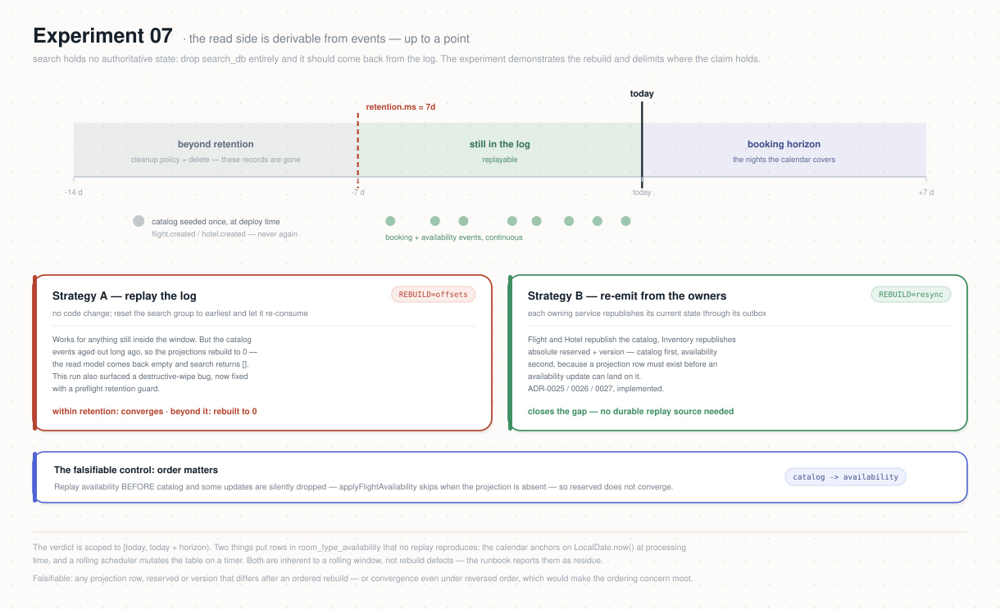

# Experiment 07 — Read Model Rebuild

**Category:** Architecture · **Type:** Rebuild / replay · **Status:** READY — two modes:
`REBUILD=offsets` (within-retention, replay the log, no code change) and `REBUILD=resync`
(beyond-retention, re-emit from the owners — Strategy B, ADR-0025/0026/0027, implemented)

## Why this experiment

The CQRS claim for Atlas is that the read side (search) holds **no authoritative state** — it is a
pure projection, fully **derivable by replaying events** (`docs/architecture.md`, ADR-0008/0009).
If that holds, the entire `search_db` can be dropped and rebuilt from the event log with no loss.
This experiment demonstrates the rebuild and, just as importantly, delimits *where the claim
currently holds*: the projection logic is deterministic and idempotent, so a rebuild converges — but
only for events still in the log. All source topics are `cleanup.policy=delete`,
`retention.ms=7d`, so full derivability beyond 7 days needs a durable replay source; the chosen
answer is **Strategy B — republish/resync from the owning services** (that decision doc is
[`rebuild-source-of-truth.md`](./rebuild-source-of-truth.md); productionization is
ADR-0025/0026/0027).

## Hypothesis

Given a dataset created within the retention window, after wiping the entire read model and
replaying the events in **catalog-before-availability** order, the rebuilt `search_db` converges to
the exact pre-wipe state:

1. **Catalog converges.** `flight_projections` (catalog columns + `status`) and
   `hotel_projections` + `hotel_room_types` match row-for-row (by natural key), same counts.
2. **Availability converges.** `flight_projections.reserved`/`version` and every
   `room_type_availability` night (`resource_id`, `stay_date`, `capacity`, `reserved`, `version`,
   `status`) **within the current booking horizon** match — the absolute+`version` model makes
   replay order-independent *once the catalog row exists*.
3. **Order matters (falsifiable control).** If availability is replayed **before** catalog, some
   updates are dropped (`applyFlightAvailability`/`applyHotelAvailability` skip when the projection
   is absent) and `reserved` does **not** converge — proving the rebuild must sequence catalog first.

Falsifiable: any projection row, `reserved`, or `version` that differs after an ordered rebuild;
counts that don't match; or convergence even under reversed order (which would mean the ordering
concern is moot).

> **The night calendar is only partly event-derived — so the verdict is scoped to the window the
> events determine: `[today, today + horizon)`.** Two things put rows in
> `room_type_availability` that no replay can reproduce: `materializeHotelCalendar` anchors on
> `LocalDate.now()` at **processing** time (the same event replayed on a different day writes
> different nights), and `HotelProjectionRollingScheduler` mutates the table on a timer, leaving
> up to `purge-after-days` of **past** nights behind. Both are inherent to a rolling window, not
> rebuild defects. `runbook.sh` therefore asserts only inside the window and **reports** the rows
> outside it as residue; a rebuild is expected to take that residue to 0. The date is pinned once
> so a midnight rollover fails loudly instead of masquerading as divergence. Full reasoning:
> [`derivable-scope.md`](./derivable-scope.md).



## What it does

`runbook.sh` (search-side, no code change — proves derivability **within retention**):

1. **Guardrails + resolve pods** (kubectl context, Postgres primary, Kafka broker, search deploy);
   no other load.
2. **Snapshot BEFORE** — per read-model table: row count + a content **checksum over the semantic
   columns** (natural key + projected fields, excluding the random night PK and `updated_at`).
3. **Quiesce search** — scale `search-service` to 0 so the consumer group has no members (required
   to reset offsets).
4. **Wipe** — `TRUNCATE flight_projections, hotel_projections, hotel_room_types,
   room_type_availability, consumed_events` in `search_db`.
5. **Ordered replay** (the ordering fix, no code):
   - reset the `search-service` group to `earliest` for the **catalog** topics and to `latest` for
     the **availability** topics; scale search up; wait until catalog is projected (lag 0 on catalog).
   - scale to 0; reset the **availability** topics to `earliest`; scale up; wait lag 0.
6. **Snapshot AFTER** + **verdict** — counts and checksums equal BEFORE; print a diff on mismatch.
   Optional §3 control run: reset availability first to show non-convergence.

## Prerequisites

- Shared setup ([repo README](../README.md)): `kubectl` context, `.env` (only for the optional
  seed/booking step), `psql`/Kafka access via the cluster pods.
- A dataset **created within the last 7 days** whose catalog + availability events are still in the
  log (a fresh `make -C .. reset` + a seed + a small booking batch is the cleanest baseline).
- No other load during the run (the read model must be quiescent to snapshot/compare).
- **Beyond-retention** rebuild (data older than 7 days) is covered by `REBUILD=resync`, which
  re-emits current state from the owning services (Strategy B, ADR-0025/0026/0027 — implemented) and
  does not read the historical log at all.

## How to run

```bash
cd experiments/07-read-model-rebuild
set -a; source ../.env; set +a
DRY_RUN=1 ./runbook.sh                    # preview, change nothing
CONFIRM=yes ./runbook.sh                  # within-retention: wipe + ordered log replay + verify
CONFIRM=yes CONTROL=1 ./runbook.sh        # also run the reversed-order control (expect
non-convergence)
CONFIRM=yes REBUILD=resync ./runbook.sh   # beyond-retention: wipe + re-emit from owners + verify
```

Env knobs: `REBUILD` (`offsets` = replay the existing log within retention, default; `resync` =
re-emit current state from the owning services, ADR-0025/0026/0027, works beyond retention),
`SETTLE` (seconds per drain phase, default 180), `SCOPE` (`all` | `flights`, default `all`),
`CONTROL` (demonstrate the ordering failure; offsets mode only), `DRY_RUN`, `CONFIRM`.

**`REBUILD=resync` flow.** Snapshot BEFORE → scale search to 0 → TRUNCATE the read model → scale
search up → `POST /actuator/resync` on flight-service (and hotel-service when `SCOPE=all`), wait for
catalog to project → `POST /actuator/resync` on inventory-service, wait for availability → verify
convergence. Each owner republishes its current DB state through the outbox, so this does **not**
depend on old events still being in the log — it is the beyond-retention proof. Requires the images
built with ADR-0025/0026/0027 and `curl` locally (calls the internal management port via
port-forward).

## What to watch (Grafana)

A dedicated dashboard ships with this experiment: **Atlas — Experiment 07: Read Model Rebuild**
(`deploy/platform/observability/atlas-exp07-dashboard.yaml`). On the GitOps path it is installed at
cluster bootstrap by the `obs-config` Application; otherwise apply it once:

```bash
kubectl apply -f deploy/platform/observability/atlas-exp07-dashboard.yaml
kubectl -n atlas-observability port-forward svc/kps-grafana 3000:80    # admin / atlas-admin
```

⚠️ search-service exposes **no domain metrics**, so unlike the other experiment dashboards this
one cannot show convergence directly — `runbook.sh`'s checksum comparison remains the only
authoritative pass/fail. What it does show is the rebuild happening: the per-topic lag panel
makes the **catalog-before-availability** ordering visible, and `search_db` insert rate tracks
the reprojection. The table below adds the rest.

| Layer | Panel / query | Healthy signal |
|-------|---------------|----------------|
| Rebuild lag | `kafka_consumergroup_lag{consumergroup="search-service"}` | spikes to the full backlog after each offset reset, drains to 0 per phase |
| Read model | row counts of `flight_projections` / `room_type_availability` | drop to 0 on wipe, climb back to the baseline |
| Ordering (optional) | `atlas_search_availability_orphaned_total` (proposed meter) | 0 under ordered replay; > 0 in the reversed-order control |

## Success criteria

- Counts of all read-model tables after the ordered rebuild equal the pre-wipe counts —
  `room_type_availability` **counted within `[today, today + horizon)`**, the window the events
  determine (see the note under *Hypothesis*).
- Semantic checksums (catalog + availability, by natural key) match BEFORE == AFTER, over the
  same window.
- No `reserved`/`version` drift on flights or hotel nights.
- Control (if run): reversed order leaves `reserved` short → convergence fails, proving the
  catalog-before-availability sequencing requirement.

**Reported, not asserted:** rows outside the window (past nights pending purge, per-hotel calendar
drift). The runbook prints the count before and after; a rebuild is expected to take it to 0,
because that state comes from maintenance jobs and processing-time anchoring rather than from the
event log. A non-zero *after* value would be the surprising result.

## Results & decisions

Record runs in [`RESULTS.md`](./RESULTS.md). Decisions:

- [`rebuild-source-of-truth.md`](./rebuild-source-of-truth.md) — compaction vs. republish; **Strategy
  B (republish/resync)** chosen to close the beyond-retention gap.
- [ADR-0025](../../docs/adr/ADR-0025-flight-catalog-resync.md) (Flight) /
  [ADR-0026](../../docs/adr/ADR-0026-hotel-catalog-resync.md) (Hotel) /
  [ADR-0027](../../docs/adr/ADR-0027-inventory-availability-resync.md) (Inventory) — the per-owner
  resync capability (`POST /actuator/resync`), **COMPLETED**.
- [`derivable-scope.md`](./derivable-scope.md) — the 2026-07-26 run reported a failure that was
  not one: the rebuild produced a perfect calendar while the *live* table carried 898 rows that no
  replay can reproduce. Establishes which part of the read model events actually determine, and
  scopes the verdict to it.
- [`calendar-write-path.md`](./calendar-write-path.md) — why replaying `hotel.created` was slow.
  One catalog event materializes a year of nights, and each night cost a `SELECT` **plus** an
  unbatched `INSERT`; batching the write path was chosen over adding partitions, which is
  irreversible and would have broken per-hotel event ordering
  ([ADR-0029](../../docs/adr/ADR-0029-search-calendar-write-path.md), Search).
