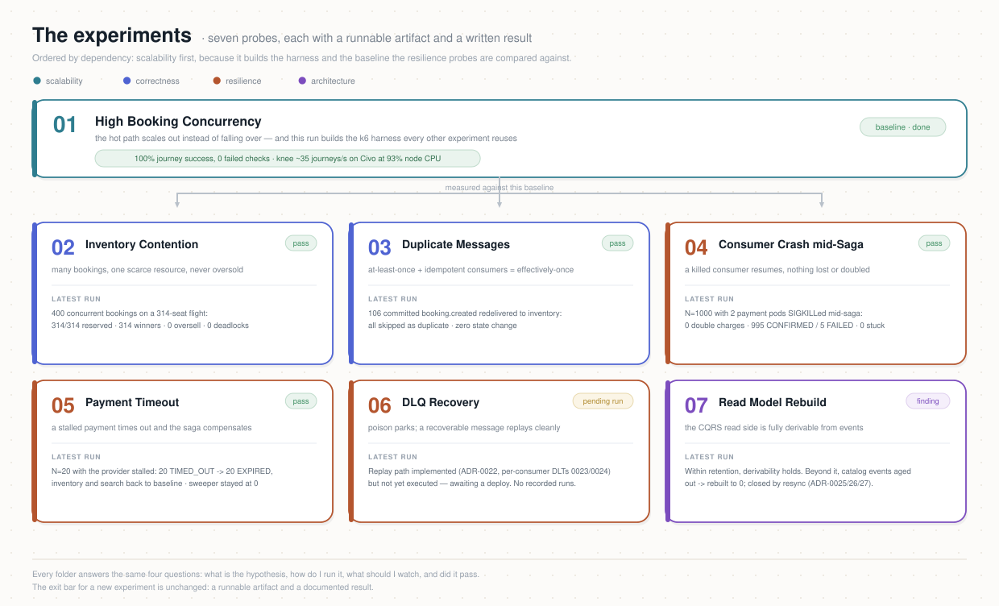

# Atlas Experiments

A reproducible **engineering laboratory** for the [Atlas](https://github.com/atlas-event-lab)
event-driven travel-booking platform. Each experiment is a self-contained, runnable probe
into how the distributed system behaves under load or failure — with a script you can run
and a written result a human can read.


## What's here

```
experiments/
├── README.md                      ← you are here
├── TEMPLATE.md                    ← copy this to start a new experiment
├── .env.example                   ← configuration (copy to .env)
├── Makefile                       ← convenience runners
├── scripts/
│   └── seed-loadtest-users.sh     ← provision the Keycloak load-test user pool (idempotent)
├── lib/k6/                        ← shared harness (config, auth, cart + booking helpers)
│   ├── config.js
│   ├── auth.js
│   ├── cart.js
│   └── booking.js
└── NN-experiment-name/
    ├── README.md                  ← hypothesis, method, how to run, what to watch
    ├── load.js  (or runbook.sh)   ← the runnable artifact
    └── RESULTS.md                 ← recorded runs
```

Every experiment folder answers the same questions in its README: **what is the
hypothesis, how do I run it, what should I watch, and did it pass.**

## The roadmap of experiments

Grouped by what they prove. Ordered roughly by dependency — scalability first (it builds
the harness and the baseline), then the resilience / correctness probes that compare
against that baseline.



| # | Experiment | Category | Hypothesis — what it proves |
|---|------------|----------|-----------------------------|
| 01 | [High Booking Concurrency](./01-high-booking-concurrency) | Scalability | HPA scales the hot path; the pooler keeps DB connections bounded; degradation is graceful, not a cliff |
| 02 | [Inventory Contention](./02-inventory-contention) | Correctness | Many concurrent bookings for the same scarce resource never oversell |
| 03 | [Duplicate Messages / Idempotency](./03-duplicate-messages-idempotency) | Correctness | At-least-once delivery + idempotent consumers = effectively-once |
| 04 | [Consumer Crash mid-Saga](./04-consumer-crash-mid-saga) | Resilience | A killed consumer resumes with no loss and no double-processing |
| 05 | [Payment Timeout → Compensation](./05-payment-timeout-compensation) | Resilience | A stalled payment times out and the Saga compensates, returning stock |
| 06 | [DLQ Recovery](./06-dlq-recovery) | Resilience | A poison message parks in the DLQ; a recoverable one replays cleanly |
| 07 | [Read Model Rebuild](./07-read-model-rebuild) | Architecture | The CQRS read side is fully derivable by replaying events |

Grafana includes dashboards for almost all experiments. Experiment 03 reuses the dashboard from Experiment 02. It also provides useful dashboards for Kafka, HTTP metrics by endpoint, and CloudNativePG database metrics.


### Results so far

Each folder's `RESULTS*.md` holds the raw runs; this is the summary verdict.

| # | Status | Result (latest run) |
|---|--------|---------------------|
| 01 | ✅ Done | 100% journey success, 0 failed checks. **Knee measured at ~35 journeys/s on Civo**, where the nodes sit at 93% CPU (~320m of CPU per journey) — degradation past it is latency, not errors. `TARGET_RPS=60` is unreachable on that cluster and shows up as VU starvation, not as system failure; see the note in the experiment README. |
| 02 | ✅ Pass | 400 concurrent bookings on one flight (capacity 314): **no oversell** — 314/314 reserved, 314 winners, 0 stuck, 0 deadlocks. Invariant held. |
| 03 | ✅ Pass | Redelivered 106 already-committed `booking.created` to inventory: **all skipped as duplicate**, zero state change → effectively-once demonstrated. |
| 04 | ✅ Pass | N=1000 with 2 payment pods killed mid-saga: **0 double charges**, final lag 0, 995 CONFIRMED / 5 FAILED, **0 left PROCESSING** → the system converged. |
| 05 | ✅ Pass | N=20 with the provider stalled: all 20 `TIMED_OUT` → all 20 `EXPIRED`; inventory **and** search reserved counts returned to baseline (compensation complete); recovery sweeper stayed at 0. |
| 06 | 🚧 Pending run | Replay path implemented ([ADR-0022](../docs/adr/); per-consumer DLTs ADR-0023/0024) but **not yet executed** — awaiting a deploy. No recorded runs. |
| 07 | 🔎 Finding | `offsets`-mode rebuild **confirmed the beyond-retention gap** (catalog events aged out of 7-day retention → rebuilt to 0) and surfaced a destructive-wipe bug, now fixed with a preflight retention guard. Within-retention derivability holds; beyond-retention is closed by **resync** (Strategy B, ADR-0025/0026/0027, implemented). |

All seven have a folder, a runnable artifact. See each folder's README for detail.


## Prerequisites

- **[k6](https://k6.io/docs/get-started/installation/)** — the load-testing tool
  (`brew install k6`, or see the docs for your OS).
- **kubectl / helm** access to the Atlas cluster (for the fault-injection experiments and
  to watch scaling).
- **Grafana** access — the experiments are observed there (metrics ↔ logs ↔ traces from
  Phase 6). Most experiments are only meaningful *while watching* the dashboards.
- A realm **test client + test user** for auth. The bootstrap script already creates 200 load users by default.

## Configuration

```bash
cp .env.example .env
# edit .env: ATLAS_GATEWAY, KEYCLOAK_URL
```

Everything is environment-driven — no cluster specifics are baked into the scripts, so the
same experiments run against any Atlas deployment.

### Auth for load tests

Experiments authenticate via OAuth2 password grant against a dedicated confidential client,
so each booking carries a genuine `UserId` (the JWT subject).

Crucially, each k6 VU logs in as its **own** user from a pool (`loadtest-1`, `loadtest-2`,
…). This is not just for realism: the travel-cart service keeps **one active cart per
user**, so if every VU shared one identity they'd collide on a single cart. One user per VU
keeps carts isolated. The pool size therefore caps concurrency — the harness ties `MAX_VUS`
to `LOADTEST_USER_COUNT`.

**Credentials are never typed by hand.** All three secrets already exist in the cluster, so
you read them from it instead of filling them into `.env`:

| Value | Where it comes from |
|-------|---------------------|
| `KEYCLOAK_CLIENT_SECRET` | generated by Keycloak for the `atlas-loadtest` client (confidential, *Direct Access Grants* on) — created by `deploy/platform/keycloak/realm-import.yaml` |
| `LOADTEST_USER_PASSWORD` | `secret/atlas-realm-credentials`, key `loadtest-password` |
| `KEYCLOAK_ADMIN_PASSWORD` | `secret/keycloak-initial-admin` (the bootstrap admin) |

`scripts/cluster-credentials.sh` fetches all of them and prints `export` lines. Evaluate it
into your shell, then seed the pool:

```bash
export LB=<ingress EXTERNAL-IP>  # kubectl -n atlas-system get svc ingress-nginx-controller  
eval "$(./scripts/cluster-credentials.sh)"      # sets the three secrets + KEYCLOAK_URL
LOADTEST_USER_COUNT=200 ./scripts/seed-loadtest-users.sh
```

Run it without `eval` first if you want to see what it would set — it prints to stdout, so
nothing is exported until you ask for it.

> `deploy/argocd/bootstrap.sh` already runs this fetcher once at the end and confirms all
> three values resolve (a `✔ Experiment credentials generated and fetchable` line); if it
> can't, it prints the exact commands to get them. You still `eval` the script here to load
> them into *your* shell before a load test — bootstrap only verifies, it can't export into
> a shell it doesn't own.

The script is **idempotent** — re-run it anytime, and raise `LOADTEST_USER_COUNT` to grow
the pool (existing users are kept). The users are **reused across all experiments**; you
only seed once. Don't run two load experiments concurrently against the same pool (they'd
share users → carts). These are test-only accounts; never point them at real users.

**How many users?** One per concurrent VU. Concurrency ≈ `TARGET_RPS × journey_seconds`; a
degraded journey is ~4 s, so `users ≈ TARGET_RPS × 4 × 1.3`. 200 covers the default
`TARGET_RPS=30` with headroom; a smoke run (1 VU) needs only `loadtest-1`.

## Running

```bash
set -a; source .env; set +a          # load config into the shell
make run EXP=01-high-booking-concurrency
# or directly:
cd 01-high-booking-concurrency && k6 run load.js
```

Save a machine-readable summary alongside your notes:

```bash
make run EXP=01-high-booking-concurrency K6_FLAGS="--summary-export=summary.json"
```

## Adding an experiment

Copy [`TEMPLATE.md`](./TEMPLATE.md) into a new `NN-name/` folder, reuse `lib/k6/`, and fill
in the README + RESULTS. Keep the exit bar: **a runnable artifact and a documented result.**

### Per-experiment decision & findings docs

An experiment folder is not only its `README.md` (hypothesis/method) and `RESULTS*.md` (raw
runs). When a run **surfaces a change** — a bottleneck to fix, a tuning decision, an
architecture adjustment — capture the reasoning **inside the same folder** as a decision /
findings doc (e.g. `payment-service-scaling.md`). That doc is the narrative half of the
result: what we found, what we decided and why, the validations, and the conclusion. Keeping
it next to the run that motivated it is what makes the change traceable to *this* stage.

The convention per folder is therefore:

- `README.md` — hypothesis, method, how to run, what to watch.
- `RESULTS*.md` — recorded runs (the numbers).
- `<topic>.md` — decision / findings docs for changes the runs surfaced (zero or more).

**Promote binding cross-service decisions to ADRs.** A findings doc scoped to an experiment is
the right place to *reason*, but changes that span services are binding architecture decisions
and must also be recorded as **ADRs, one per affected service** (`DR-002`), flipped to
`COMPLETED` when implemented and merged (`DR-003`). The findings doc and the ADRs cross-link.
Precedent: [`ADR-0007`](../docs/adr/) and `01-high-booking-concurrency/payment-service-scaling.md`
both came out of Experiment 01.
